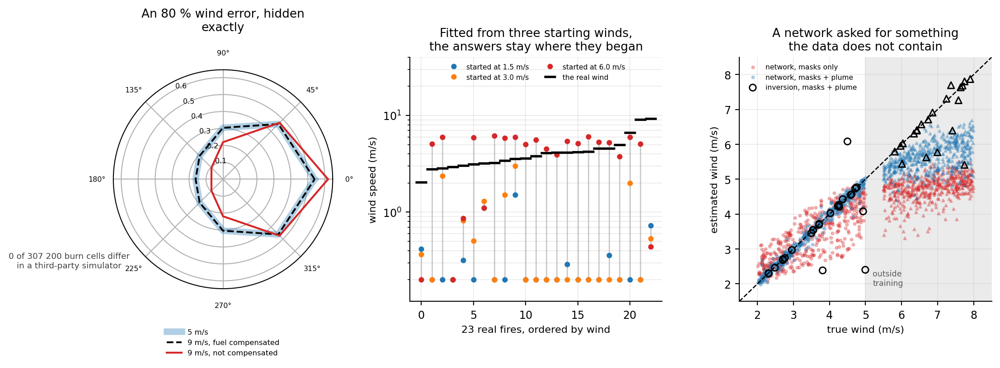

# PyroField

**A burn scar cannot tell you the wind.** A differentiable wildfire forward model, and the
identifiability machinery to ask what each sensor actually determines — before asking how
accurately anything predicts.



A burn mask constrains a fire only through its head spread rate and its shape. Rothermel's
head rate is `R0 (1 + phi_w + phi_s)`, so fuel and wind enter as a **product**; the shape is
the only channel that could separate them, and it is weak, saturating, and — measured on
895 real fires — scatters by 46 % where 8–21 % would be needed. The null direction is
closed form and matches the measured one to six significant figures.

The consequence is not academic. A network given only burn masks scores **better** than an
honest inversion on a parameter provably absent from its input, and every standard
validation protocol ranks it first.

---

## Results

| | |
|---|---|
| **Exact, and not this code's** | In [PyTorchFire](https://arxiv.org/pdf/2502.18738) — a third-party stochastic cellular automaton sharing no code, numerical family or spread law — compensating an **80 %** wind error along the null curve leaves the eight lattice probabilities unchanged to machine precision, and the realised fires are identical in **0 of 307 200 cells** |
| **895 real perimeters** (NIFC + ERA5) | shape explains **2.3 %** of the variance in wind; scatter against Anderson's relation **46 %** |
| **1044 fire-days** (WildfireSpreadTS + GRIDMET) | daily advance explains **~1 %** of the variance in wind speed; fuel and terrain explain **9×** more than wind |
| **23 real fires inverted** | fitted from three starting winds spanning 4×, the answers scatter **25×** while the fit quality moves 2×; wind speed lands **94 %** from the truth, bearing within 45° on **65 %** (25 % by chance) |
| **Channel ablation**, all 607 fires | wind channels are worth **0.99×** the fire mask alone; the raw VIIRS imagery is worth **2.67×** |
| **2135 ignition backtracks** | with the spread rate an investigator can actually obtain, the feasible origin is **100 % of the burn scar** |
| **The method this implies** | an inversion reporting a verdict per parameter, not a number — it catches **19 of 25** wrong answers where a residual check catches 10 |

Full write-up with every table, figure and caveat: **[RESULTS.md](RESULTS.md)** (21 sections).
Paper-ready tables with LaTeX: **[PAPER_TABLES.md](PAPER_TABLES.md)** (27 tables).

---

## Quickstart

```bash
pip install torch numpy scipy matplotlib rasterio scikit-learn requests shapely pyproj
python scripts/null_direction.py     # the exact degeneracy, in closed form  <-- start here
python scripts/verify_results.py     # re-derive all 169 numbers from results/*.json
```

A 24 GB consumer GPU is ample: peak usage is about 0.5 GB and the forward model takes
0.3–0.6 s. Every experiment and its runtime is in **[REPRODUCE.md](REPRODUCE.md)**.

## Verification

`scripts/verify_results.py` re-derives **169** headline numbers from `results/*.json` and
fails if the write-up disagrees, then audits cross-references, figure and script
references, encodings, and the generated tables. Run it after changing anything. A number
that was correct when written and went stale is the likeliest error in a repository this
size, and it has happened here.

## Layout

```
pyrofield/physics/      level set, Rothermel rates, smoke transport
pyrofield/models/       burn-mask, plume-rendering and Gaussian-plume operators
pyrofield/theory/       Fisher information, CRB, sensor-subset lattice
pyrofield/eval/         Levenberg-Marquardt inversion, and the guarded version
scripts/                47 experiments, each reproducing one section
results/                the json every number is read from
figures/                34 figures
data/                   not in git — 48 GB, rebuilt by the fetch_* and gen_* scripts
```

## What this repository is honest about

[RESULTS.md §20](RESULTS.md) lists **22 hypotheses the data corrected**, five of which
reversed a conclusion after it had been written down. Among them: a headline number that a
larger rerun moved by a factor of six, a channel ablation whose first version claimed the
opposite of the truth, and a real-fire inversion that reported 5 % accuracy when the
optimiser had in fact frozen at its starting values.

The limits are in [§21](RESULTS.md), not buried: small inversion samples, one architecture
in the learned baseline, filter-selected fires, and a method that is a guard rather than a
system.

## Data

Nothing in `data/` is redistributed. Everything is fetched by script from its source:

- [NIFC WFIGS](https://data-nifc.opendata.arcgis.com/) final perimeters — `fetch_perimeters.py`
- [ERA5](https://open-meteo.com/) via the Open-Meteo archive API — `fetch_wind.py`
- [WildfireSpreadTS](https://doi.org/10.5281/zenodo.8006177) (Gerard, Zhao and Sullivan,
  NeurIPS 2023 D&B), CC-BY-4.0 — `fetch_wsts.py`, which reads that 45 GB archive
  selectively with range requests so reproducing needs 17 GB, not 45
- [PyTorchFire](https://arxiv.org/pdf/2502.18738) — `pip install pytorchfire`

## License

MIT for the code in this repository. The datasets above keep their own licences.
