# Week-0 results

Everything here was measured on this machine (RTX 3090, PyTorch 2.11, CUDA 12.6).
Logs and raw numbers are in `results/`, figures in `figures/`.

The central claim is algebraic, not statistical:

> **A burn mask constrains the fire's physics only through what its outline encodes: the
> head spread rate and the shape of the ellipse. The head rate confounds fuel with wind by
> construction — Rothermel's model is `R_head = R0 (1 + phi_w + phi_s)`, so fuel and wind
> enter as a product — which leaves the shape as the only channel that could separate
> them. That channel is weak and it saturates.**
>
> Under the length-to-breadth law FARSITE actually uses (Anderson 1983, truncated at 8),
> the shape stops responding to wind entirely above a midflame speed of **3.80 m/s**, and
> it separates fuel from wind below that only if the single empirical curve is taken as
> exact for the fuel in front of you. Allow the fuel-to-fuel variation the literature
> documents and the separation vanishes at every wind speed. Three of four regimes are
> degenerate, and the one that is not rests on an assumption FARSITE makes for
> convenience.
>
> The consequence is not academic. Across 69 fires, parameter sets that reproduce the
> observed past *identically* predict the fire's arrival at a road over a window of
> 6 minutes (median; up to 16), with forecast IoU as low as 0.18. Reading the smoke plume
> collapses that to the right answer, and buys more than 22 minutes of lead time on
> knowing the wind that drives the fire.
>
> On **895 real NIFC fire perimeters joined to ERA5 wind**, the shape channel is weaker
> still: it explains **2.3 %** of the variance in wind with no fire model at all, and
> scatters by **46 %** against Anderson's own relation — against the 8-21 % precision the
> separation would need.
>
> The degeneracy is not this code's. In **PyTorchFire**, a third-party stochastic cellular
> automaton sharing no implementation, no numerical family and no spread law, the same two
> trades hold *exactly*: an 80 % wind error compensated along the null curve leaves the
> eight lattice probabilities unchanged to machine precision, and the realised fires are
> identical in **0 of 307 200 cells**.
>
> On **1044 fire-days from 201 real fires** in WildfireSpreadTS, observed by VIIRS with the
> GRIDMET wind that drove them, the daily advance explains about **1 %** of the variance in
> wind speed, and under 6 % at the best measurement quality available. The bearing does
> better. Fuel and terrain explain nine times more of the advance than the wind does, and
> conditioning on the fuel proxies an operational system actually has does not sharpen the
> wind estimate at all.
>
> The same result decides two tasks beyond forecasting. A **channel ablation** on the
> benchmark's own next-day spread task, one network trained seven times with channels
> zeroed, finds the wind channels worth **0.86x** the fire mask alone and **13 % worse**
> than leaving them out of the full input; what buys the near-doubling is the raw VIIRS
> imagery, not the weather. And **backtracking 2135 times on 121 real fires** to find where
> each started returns, with the spread rate an investigator can actually obtain,
> **100 % of the burn scar** — the answer "somewhere in the burned area".
>
> One of this document's own headline numbers did not survive being remeasured. Rerunning
> the state-level inversion on **60 independently drawn fires** instead of 25 moved its
> out-of-distribution median from 0.8 % to **5.0 %**, with an interval that excludes the
> original, and a claim that the gap between fusion levels *widens eightfold* out of
> distribution had to be retracted — it narrows. The statistic was a median across a
> bimodal distribution, which the same section had identified one subsection earlier.
>
> And it matters where you fuse. A convolutional network given only masks reaches 10.3 % on
> wind speed in distribution — better than the honest inversion, on a parameter provably
> absent from its input — then answers **4.80 m/s** for fires actually blowing at 6.79.
> Every one of the twelve mask-only inversions that lands far from the truth fits the
> observations **exactly as well as the truth does**. Held-out accuracy cannot tell the two
> failures apart; only stepping outside the training distribution can.

Twenty-two hypotheses were corrected along the way by measurements that contradicted them —
three caused by bugs of my own, and one by checking my own physics against the published
model rather than against my memory of it. All twenty-two are in section 20.

---

## 1. The exact degeneracy, for a shape law with a free fuel coefficient

`scripts/null_direction.py`

**Read section 2 with this one.** The result below is exact, but it assumes a
length-to-breadth law carrying a fuel-dependent coefficient. Section 2 puts FARSITE's own
law in its place and reports what survives.

The elliptical spread template determines the fire front from

```
R_head = R0 * (1 + a * U^b)          LB = 1 + k_LB * U
```

The first of these is Rothermel (1972) exactly: `S = R0 (1 + phi_w + phi_s)`, with `R0`
the no-wind no-slope rate. The second is a modelling choice made here, and section 2
replaces it.

A mask sees the front and nothing else, so it is a function of `(R_head, LB, theta_w)`.
The Jacobian of `(R_head, LB)` with respect to `(R0, U, k_LB)` is a 2x3 matrix: rank at
most 2, nullity at least 1. Differentiating in log parameters gives the null direction in
closed form:

```
v = ( -a*b*U^b / (1 + a*U^b),  1,  -1 )
```

**Check 1 — against the numerics.** The weakest eigenvector of the measured mask-only
Fisher matrix, at CFL-matched time steps across the envelope:

| wind | CFL | analytic v | measured weakest eigenvector | abs(cos) |
|---|---|---|---|---|
| 2 m/s | 0.19 | (-0.3915, +0.6507, -0.6507) | (-0.3919, +0.6494, -0.6517) | 0.999999 |
| 3 | 0.25 | (-0.4789, +0.6207, -0.6207) | (-0.4794, +0.6184, -0.6227) | 0.999995 |
| 4 | 0.31 | (-0.5299, +0.5997, -0.5997) | (-0.5301, +0.5991, -0.6000) | 1.000000 |
| 6 | 0.35 | (-0.5839, +0.5741, -0.5741) | (-0.5851, +0.5767, -0.5701) | 0.999988 |
| 9 | 0.35 | (-0.6197, +0.5550, -0.5550) | (-0.6216, +0.5595, -0.5482) | 0.999965 |

Six significant figures, across a 4.5x range of wind speed.

**Check 2 — walking along it.** The null space is a *curve*, not a line, because `R0` and
`k_LB` depend nonlinearly on `U`. Forcing a wind error and compensating exactly:

| wind error | along the exact curve | along its tangent | no compensation |
|---|---|---|---|
| 5 % | dchi2 = 0.52 | 1.8 | 8 214 |
| 10 % | 0.13 | 14.8 | 31 728 |
| 20 % | 0.52 | 179 | 112 735 |
| 30 % | **0.20** | 791 | **220 364** |

A 30 % wind error costs **dchi2 = 0.20** when compensated along the curve and **220 364**
when not — a factor of 1.1 million. The tangent costs 791, and that gap is pure curvature.
**That curvature is exactly why a linearised Fisher analysis cannot see this degeneracy**
(section 11).

**Check 3 — in someone else's model.** Section 13 repeats this in PyTorchFire, a
third-party stochastic cellular automaton that shares no code, no numerical family and no
spread law with this one, and finds the same two trades and the same null direction — there
exactly, to machine precision, with realised fires identical cell for cell.

---

## 2. Does it survive FARSITE's own shape law?

`scripts/farsite_lb.py`

Section 1 assumes `LB = 1 + k_LB * U` with a free fuel coefficient. FARSITE and FlamMap do
not use that. They use Anderson (1983) in the form

```
LB = 0.936 exp(0.2566 U) + 0.461 exp(-0.1548 U) - 0.397,     U in mi/h
```

with **no free fuel parameter** — the relation is stated as applying to any fuel type — and
truncated at LB = 8, the maximum in the empirical data Alexander (1985) collects. Taken at
face value that would break the degeneracy outright: the shape would give the wind, and the
head rate would then give the fuel. Checking this changed the claim, so it gets its own
section.

**The relation saturates inside the operating range.** The cap is reached at
**U = 3.80 m/s (8.49 mi/h)**:

| U (m/s) | 0.5 | 1.5 | 2.5 | 3.5 | **3.79** | 4.0 | 5.0 | 7.0 |
|---|---|---|---|---|---|---|---|---|
| LB uncapped | 1.24 | 2.09 | 3.73 | 6.72 | **7.97** | 9.02 | 16.19 | 47.7 |
| LB as used | 1.24 | 2.09 | 3.73 | 6.72 | **7.97** | **8.00** | **8.00** | **8.00** |
| dLB/dU | 0.58 | 1.18 | 2.19 | 3.96 | 2.61 | **0** | **0** | **0** |

**What the data actually supports** (profile likelihoods over +/-45 % in wind, masks only):

| | U = 3 m/s (shape responds) | U = 5 m/s (shape clamped) |
|---|---|---|
| shape law taken as exact | sigma = **0.22 %** — determined | over-estimation: sigma **> 19.6 %**, unbounded |
| shape law uncertain (free fuel scale) | sigma **> 56.8 %** — degenerate | sigma **> 17.7 %** — degenerate |

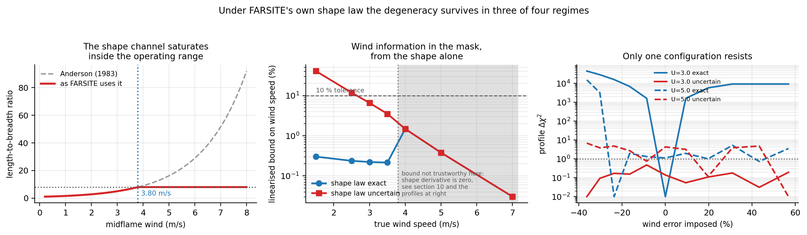

Three findings, in order of how much they change the story:

- **Below the cap with the relation taken as exact, the mask does determine the wind**, to
  0.22 % — the profile rises to dchi2 = 45 427 over the scan. The section 1 degeneracy does
  *not* hold in that corner, and saying otherwise would have been wrong.
- **Allowing the relation a free fuel scale restores the degeneracy completely.** At 3 m/s
  the profile never rises above dchi2 = 0.5 across +/-45 %. Whether this is the right
  assumption is a question about Anderson's relation, not about this code: Anderson reports
  group-specific curves and Alexander documents the scatter, and FARSITE's single curve is
  a convenience.
- **Above the cap the degeneracy is exactly one-sided, and the open side is the dangerous
  one.** Forcing the wind *down* eventually leaves the cap and the shape responds again;
  forcing it *up* keeps LB pinned at 8 and the mask sees nothing:

  | imposed U error | -36 % | -30 % | **-24 %** | -16 % | 0 | +20 % | +43 % | +57 % |
  |---|---|---|---|---|---|---|---|---|
  | dchi2 | 15 455 | 3 239 | **0.0** | 2.0 | 1.1 | 1.0 | 0.7 | 3.6 |

  The break is at -24 %, which is exactly the wind that re-enters the cap. And section 7
  shows that over-estimating the wind means under-estimating the fuel, which makes the
  forecast too slow and the warning **late**. The cap leaves precisely that side open.

### How uncertain does the relation have to be? (the load-bearing assumption, quantified)

`scripts/lb_scatter.py`

"Shape law uncertain" is doing all the work above, so it needs a number rather than an
argument. Below the cap the shape is the *only* channel carrying wind to a mask — the head
rate confounds fuel with wind by construction — so a relative uncertainty on the relation
maps to a wind uncertainty through its elasticity, with no data contribution at all:

```
sigma_lnU = sigma_lnLB / E,        E = dlnLB / dlnU
```

**The mapping is exact, and verified.** Forcing a wrong wind and paying both compensations
(`R0` to keep the head rate, the shape scale to keep `LB`) costs essentially nothing in
mask misfit — worst `|dchi2| = 1.45` over all tested points against a 1-sigma threshold of
1, several of them negative. Nothing but the prior resists.

| U (m/s) | 1.5 | 2.0 | 2.5 | 3.0 | 3.5 |
|---|---|---|---|---|---|
| E = dlnLB/dlnU | 0.843 | 1.159 | 1.468 | 1.769 | 2.062 |
| **shape relation must be known to** | **8.4 %** | **11.6 %** | **14.7 %** | **17.7 %** | **20.6 %** |

for the wind to clear a 10 % operational tolerance. Against that:

- Alexander (1985) reports **r = 0.865** between predicted and observed L/B on
  experimental fires and documented wildfires, so about **25 % of the variance is
  unexplained** by the wind-speed relation.
- Alexander's own curve tops out at L/B = 6.5 at 50 km/h where FARSITE's caps at 8, and
  the published relations do not agree on which wind they take — midflame versus open
  10 m / 20 ft.

Carrying that as a 15-35 % bracket on the relation (an inference from r, not a reported
sigma, and labelled as such):

| U (m/s) | 1.5 | 2.0 | 2.5 | 3.0 | 3.5 |
|---|---|---|---|---|---|
| resulting sigma(U) | 17.8 - 41.5 % | 12.9 - 30.2 % | 10.2 - 23.8 % | 8.5 - 19.8 % | 7.3 - 17.0 % |

**At every wind below the cap, the literature-supported accuracy of the shape relation
leaves the wind outside the 10 % tolerance.** Above the cap the elasticity is exactly zero
and no amount of knowledge about the relation helps at all.

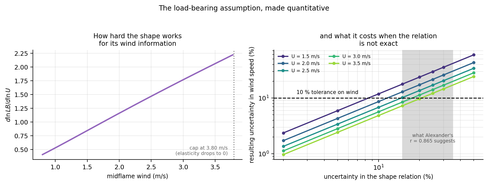

Everything downstream of here uses the free-coefficient shape law, which is the limiting
case of this — an infinitely uncertain relation. The table above is what it would take to
do better, and the literature does not supply it.

---

## 3. Real fires: does the shape predict the wind?

`scripts/fetch_perimeters.py`, `scripts/real_perimeters.py`, `scripts/fetch_wind.py`,
`scripts/real_lb_spread.py`, `scripts/real_shape_vs_wind.py`

Everything above is synthetic. This section is not: **895 final wildfire perimeters from
NIFC's WFIGS operational record**, joined to **ERA5 reanalysis wind** over each fire's
active period. It measures the quantity section 2 has been inferring around.

### 3.1 Real perimeters are not ellipses

| | |
|---|---|
| IoU with the best area-matched moment ellipse, median | **0.705** |
| fires above IoU 0.90, out of 895 | **0** |
| fires below IoU 0.70 | 48 % |
| fires that are not a single connected blob | 51.5 % |

The elliptical template — the premise of this study *and* of FARSITE — accounts for about
70 % of a real burn's shape. Elongated fires are not better described than round ones.

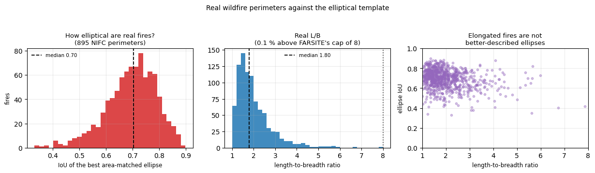

### 3.2 Real fires sit where the shape channel is weakest

Observed length-to-breadth ratios: median **1.80**, p95 3.63, and **0.11 %** above
FARSITE's cap of 8. The saturation argument in section 2 is therefore about a regime real
*final* perimeters almost never reach.

That is not a reprieve, because the elasticity `dlnLB/dlnU` vanishes as LB approaches 1:

| observed L/B | p10 = 1.24 | p25 = 1.45 | **p50 = 1.80** | p75 = 2.34 | p90 = 3.04 |
|---|---|---|---|---|---|
| implied midflame wind | 0.51 m/s | 0.82 | **1.23** | 1.70 | 2.15 |
| elasticity | 0.241 | 0.419 | **0.670** | 0.971 | 1.254 |

**Real fires cluster exactly where the shape carries least about the wind.**

### 3.3 "The" L/B of a real fire is not a well-posed number

Five defensible estimators — moment ellipse, convex hull, minimum-area rectangle, outline
fit, morphologically smoothed — applied to the same perimeter:

| | median L/B |
|---|---|
| min-area rectangle | 1.58 |
| convex hull | 1.63 |
| outline fit | 1.68 |
| moment / smoothed | 1.80 |

They disagree in the median by **14 %**, and per fire by a relative sd of **6.7 %**
(p90 = 13.8 %). On **32.4 %** of fires they differ by more than 20 %. That ambiguity alone
— before any fuel-to-fuel variation — puts the wind outside a 10 % tolerance for **50 %**
of real fires.

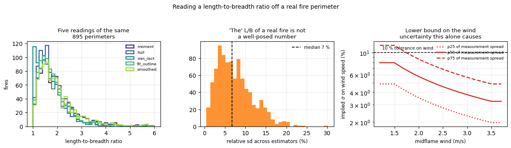

### 3.4 Model-free: the shape explains 2.3 % of the variance in wind

No fire model, no fitted parameter. Bin 440 fires (those with a coherent wind direction
over their active period) by observed shape and look at the real wind in each bin:

| L/B bin | n | wind p25 | median | p75 | p10-p90 spread |
|---|---|---|---|---|---|
| 1.0 - 1.4 | 104 | 3.77 | 4.41 | 5.51 | 76 % |
| 1.4 - 1.8 | 120 | 3.95 | 4.64 | 5.59 | 72 % |
| 1.8 - 2.3 | 95 | 3.69 | 4.75 | 5.56 | 69 % |
| 2.3 - 3.0 | 69 | 3.62 | 4.46 | 5.44 | 82 % |
| 3.0 - 4.5 | 44 | 3.99 | 5.44 | 6.36 | 75 % |

**Correlation of log L/B with log wind: r = 0.151, r² = 0.023.** Going from the roundest
fires to the most elongated moves the median wind from 4.41 to 5.44 m/s — while the wind
*within* a single shape bin spans 75 %. The shape barely moves the answer and does not
narrow it.

### 3.5 Against Anderson's relation

Fitting the wind adjustment factor (10 m to midflame) rather than assuming it:

| | |
|---|---|
| best-fit wind adjustment factor | 0.244 (plausible range 0.05 - 0.6) |
| correlation of predicted with observed L/B | **r = 0.387** |
| **residual scatter** | **46 % relative** |

Alexander (1985) reported **r = 0.865** on experimental fires and well-documented
wildfires in coniferous forest. On an operational sample the same comparison gives 0.387.
The difference is itself the finding: a relation that holds on curated fires does not hold
on the population that fire managers actually face.

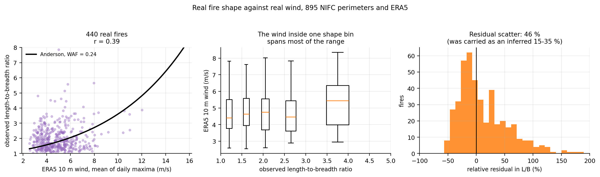

### 3.6 The number section 2 was missing

Section 2 carried a **15-35 % bracket inferred** from Alexander's correlation coefficient
and flagged it as the study's weakest link. The measured value is **46 %**, larger than
the bracket:

| U (m/s) | 1.0 | 1.5 | 2.0 | 2.5 | 3.0 | 3.5 |
|---|---|---|---|---|---|---|
| elasticity | 0.478 | 0.843 | 1.159 | 1.468 | 1.769 | 2.062 |
| **implied sigma(U)** | **96 %** | **55 %** | **40 %** | **31 %** | **26 %** | **22 %** |

**Every wind speed below the FARSITE cap misses the 10 % operational tolerance, by
measurement rather than by inference.**

One caveat in the honest direction and one in the other. ERA5 is ~25 km reanalysis, not
the wind at the flame, and final perimeters carry suppression — both inflate the measured
scatter, so 46 % is an upper bound on the *relation's own* scatter. But 46 % is exactly the
right number for the operational question, which is not "how good is Anderson's relation in
a wind tunnel" but "what can I infer about the wind from the perimeter in front of me". A
further detail points the same way: the dominant ERA5 wind direction over a fire's active
period has a median coherence of only 0.54, so even the premise that a burn scar points
downwind is weaker in the field than on paper.

---

## 4. What the fitted parameters actually do

`scripts/confound_trajectory.py`

Independently of the algebra: force the wind wrong, refit everything else to the masks,
and see where the fit goes. Theory says it must follow `R0' = R_head/(1+phi_w(U'))` and
`k_LB' = (LB-1)/U'`.

| U / U_true | R0 fitted | R0 predicted | k_LB fitted | k_LB predicted | R_head | LB | dchi2 |
|---|---|---|---|---|---|---|---|
| 0.670 | 0.13806 | 0.13805 | 0.5223 | 0.5221 | 0.31224 | 2.400 | 1.60 |
| 1.000 | 0.10001 | 0.10000 | 0.3500 | 0.3500 | 0.31223 | 2.400 | 0.14 |
| 1.492 | 0.06834 | 0.06833 | 0.2347 | 0.2346 | 0.31225 | 2.400 | 0.00 |

- median `abs(R0_fit/R0_pred - 1)` = **0.0 %**; median for `k_LB` = **0.0 %**
- `R_head` conserved to **CV 0.00 %** (truth 0.31220); `LB` to **CV 0.01 %** (truth 2.4000)
- the entire +/-40 % excursion costs at most dchi2 = 1.6

With all three sensors the same excursion costs dchi2 ~ 1e5 and the conservation breaks
(CV 1.9 % and 4.2 %) — the fit can no longer move along the valley.

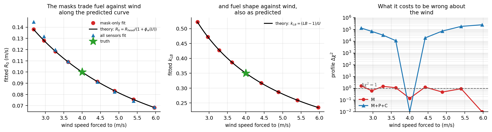

---

## 5. Terrain makes it worse, and takes the wind direction too

`scripts/terrain.py`

On flat ground masks give wind *direction* to 0.02 degrees (section 9). That is the one
place a mask was trustworthy, and it does not survive a slope. Rothermel and FARSITE
combine the wind factor and the slope factor as **vectors**; the fire responds only to
their sum, so the burn scar points along `theta_eff`, not `theta_w`.

With wind at 45 degrees (`phi_w` = 2.12) and a 23-degree slope facing 135 degrees
(`phi_s` = 1.0), the scar points at **70.2 degrees**. Reading the wind off the mask is
wrong by 25.2 degrees before any estimation error at all.

**The null space grows from one dimension to two.** Mask-only Fisher over
`(R0, U, theta_w, k_LB, phi_s)`, with the slope *aspect* known from a DEM but the slope
*coefficient* uncertain (it is fuel-dependent):

```
eigenvalues  2.222e+02  2.624e+02 | 4.241e+05  7.393e+06  9.153e+06
                                  ^ spectral gap, factor 1616
weak dir 1:  +0.76*phi_s  -0.51*theta_w  -0.24*U
weak dir 2:  +0.51*phi_s  -0.51*k_LB     +0.51*U
```

The first weak direction trades slope against wind direction explicitly. Adding the plume
removes the gap entirely (largest ratio 21) and brings CRB(theta_w) from 0.0343 rad
(2.0 degrees) to 0.00103 rad (0.06 degrees).

**What a fit actually reports**, on data generated on the slope:

| procedure | wind direction reported | error | spread over restarts | chi2/N |
|---|---|---|---|---|
| flat-ground model, masks | 70.3 deg | **25.26 deg** | — | **1.0078** |
| flat-ground model, mask+plume | 65.9 deg | 20.93 deg | — | **2.2216** |
| slope free, masks | 50.5 deg | 5.54 deg | **20.08 deg** | 1.0078 |
| slope free, mask+plume | **45.0 deg** | **0.04 deg** | **0.00 deg** | 1.0072 |

Three things at once:

- Fitting a flat model — which is what every mask-space method implicitly does — gives a
  confident answer that is 25 degrees wrong, and **chi2/N = 1.008 says nothing is amiss**.
  The reported direction lands within 0.1 degrees of the combined wind+slope vector: the
  mask reported the vector sum and called it the wind, exactly as the algebra requires.
- Adding the plume to the *same wrong model* does not fix the answer, but it **makes the
  mis-specification visible**: chi2/N more than doubles. The data refuses the wrong model
  only when a sensor is present that the wrong model cannot explain away.
- Letting the slope float is the right procedure, and only the plume can support it. For
  masks it converts a confident wrong answer into an unconstrained one — 20 degrees of
  spread across restarts, all at the same misfit. With the plume, wind direction comes back
  to 0.04 degrees and the slope factor itself is recovered to 0.3 %.

| slope factor | slope angle | scar direction | naive wind error |
|---|---|---|---|
| 0.25 | 12 deg | 51.7 deg | 6.7 deg |
| 1.00 | 23 deg | 70.2 deg | 25.2 deg |
| 2.00 | 32 deg | 88.3 deg | 43.3 deg |
| 4.00 | 41 deg | 107.1 deg | 62.1 deg |

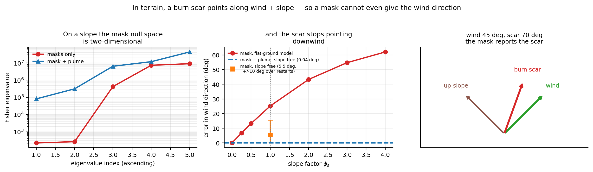

### Which way the hill faces

`scripts/terrain_aspect.py`. The sweep above varies slope magnitude at a fixed aspect, but
aspect relative to the wind is what decides how much is lost. The geometry is closed-form:

| aspect - wind | phi_s = 0.5 | 1.0 | 2.0 | 3.0 |
|---|---|---|---|---|
| 0 deg | 0.0 | 0.0 | 0.0 | 0.0 |
| 60 deg | 10.3 | 18.3 | 29.0 | 35.7 |
| 90 deg | 13.3 | 25.2 | 43.3 | 54.7 |
| **120 deg** | 13.0 | **28.1** | **57.1** | **76.5** |
| 180 deg | 0.0 | 0.0 | 0.0 | **180.0** |

(error in the wind direction read off the burn scar, in degrees)

Two things here I had wrong before measuring:

- **The worst case is at 120 degrees, not 90.** With the slope partly opposing the wind the
  resultant swings further than it does across it.
- **When the slope factor exceeds the wind factor and the two oppose, the scar flips.** At
  `phi_s` = 3.0 against `phi_w` = 2.12, a mask reports a wind blowing in exactly the
  opposite direction — not a degraded estimate, a reversed one.

And there is no aspect that is safe, because the two failure modes trade against each
other. Mask-only Fisher at `phi_s` = 1.0 with the slope factor free (read the spectral gap,
not the bound magnitudes — section 11):

| aspect - wind | scar error | CRB(theta_w) | CRB(U) | CRB(R0) | spectral gap |
|---|---|---|---|---|---|
| 0 deg | 0.0 deg | 0.00040 rad | 0.0060 | 0.0064 | 19 |
| 90 deg | 25.2 deg | **0.0343 rad (1.97 deg)** | 0.0354 | 0.0323 | 1616 |
| 120 deg | 28.1 deg | **0.0603 rad (3.45 deg)** | 0.0558 | 0.0570 | 4064 |
| 180 deg | 0.0 deg | 0.00040 rad | **0.0902** | **0.1291** | **7055** |

Aligned or opposed, the scar still points downwind and direction survives — but the head
rate is now confounding three quantities instead of two, and at 180 degrees the fuel and
wind speed are the worst in the whole sweep. Across the wind, direction goes instead:
**86x less determined at 90 degrees than at 0**.

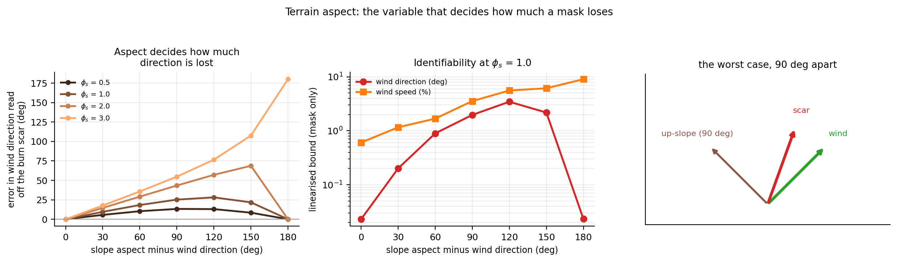

---

## 6. Heterogeneous fuel does not make it better

`scripts/heterogeneous_fuel.py`

The natural hope is that a patchwork landscape breaks the degeneracy by giving the mask
more structure to reveal. It does not, and the reason is immediate once stated: rescaling
the *whole* fuel field by a constant **is** the null direction, whatever the field looks
like. That was an argument in an earlier draft; here it is a measurement. Walking the
closed-form null curve in three landscapes:

| fuel field | dchi2 at +5 % | +10 % | +20 % | +30 % | control (+30 %, no compensation) |
|---|---|---|---|---|---|
| uniform | -0.95 | 0.31 | -0.95 | 0.17 | 222 404 |
| gradient, 0.65 - 1.35x | 0.05 | 0.15 | -0.16 | -0.06 | 201 066 |
| rough random, 2:1 range | 0.02 | -0.02 | 0.03 | 0.01 | 203 578 |

Worst dchi2 anywhere on the curve in any landscape: **0.95**, against a 1-sigma threshold
of 1. The control is **210 955x** larger.

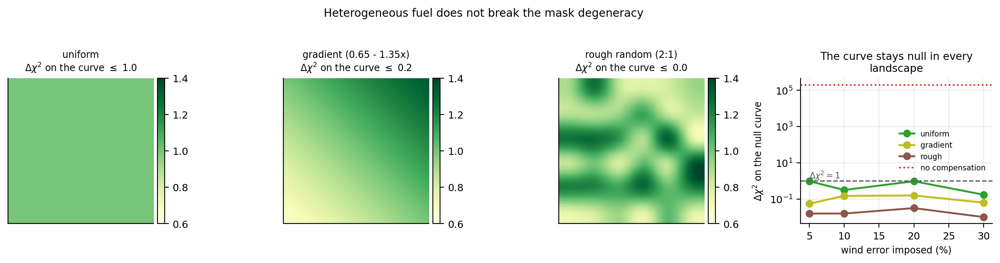

Not covered: a fuel field whose *shape* is unknown. That adds unknowns without adding mask
observables, so it can only make matters worse — which is not the direction that needs
defending.

---

## 7. The consequence: a wind shift turns the degeneracy into a forecast failure

`scripts/wind_shift_forecast.py`

Everything so far is about *estimation* — what the observations do and do not determine.
This is about consequences. Wildfire forecasts
fail — and people die — when the wind shifts and a flank becomes a head. Operationally the
future wind is the part you **do** know, because a weather model supplies it; the fuel
underneath is what you had to infer by watching the fire. Forecasting through a shift
therefore needs exactly the split masks cannot make:

```
R_head(new wind) = R0 * (1 + phi_w(U_new))
```

Watch a fire for 20 min, let the wind strengthen from 4 to 7 m/s and veer 45 degrees,
forecast 20 min, ask when the fire reaches a road.

| fitted U (m/s) | fitted R0 | **dchi2 on the observed past** | road reached | IoU at +20 | unforecast burn | false-alarm area |
|---|---|---|---|---|---|---|
| 2.4 | 0.1492 | 0.00 | 28.2 min | 0.628 | 0.9 ha | 26.2 ha |
| 3.2 | 0.1207 | 0.00 | 30.2 min | 0.810 | 0.4 ha | 10.4 ha |
| **4.0 (truth)** | **0.1000** | **0.00** | **31.2 min** | **1.000** | **0** | **0** |
| 4.8 | 0.0846 | -0.08 | 33.2 min | 0.870 | 5.9 ha | 0.2 ha |
| 6.4 | 0.0636 | 0.03 | 38.2 min | 0.706 | 13.5 ha | 0.4 ha |

Every row fits the observed past **identically** (dchi2 = 0.0 against a 1-sigma threshold
of 1), and they predict arrival times spanning **10 minutes**, IoU from 0.63 to 1.00, and
front positions differing by up to **225 m**.

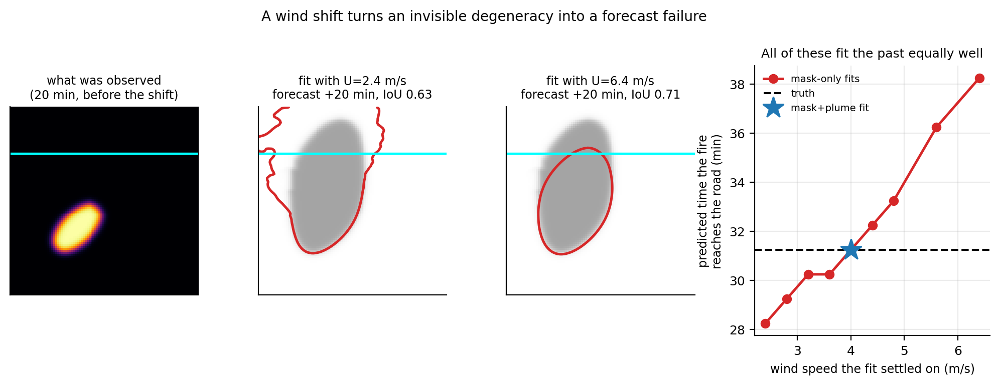

**The two errors are not symmetric.** Under-estimating the wind means over-estimating the
fuel, so the forecast runs too fast: an early warning and up to 26 ha of wasted evacuation.
Over-estimating the wind means the forecast runs too slow: a **late** warning, with up to
13.5 ha burning that was never forecast to. A mask-only fit has no way of knowing which
side of the valley it landed on.

**And it does land arbitrarily.** Six mask-only fits from different starting points all
reach the same misfit — 7.4048e+04, identical to five significant figures — and return
wind speeds from **1.34 to 3.95 m/s** (truth 4.0), predicting the road crossing anywhere
from **25.2 to 31.2 min**, IoU from 0.475 to 0.994. Which answer you get is decided by
where the optimiser started. The mask+plume fit returns U = 4.003 and the road at
31.2 min — exactly right.

### One fire is an anecdote: the same measurement over an ensemble

`scripts/forecast_ensemble.py` repeats it across the operational envelope — fuel, wind
before and after the shift, veer angle and fuel shape all drawn at random. The family of
indistinguishable fits is available in closed form, so no optimiser is needed. 69 of 80
draws survive the geometry constraints.

| quantity | median | IQR | worst |
|---|---|---|---|
| width of the arrival-time window masks cannot narrow | **6.0 min** | 5.0 - 7.0 | 16.0 min |
| worst arrival-time error within the family | 4.0 min | — | 13.0 min |
| worst forecast IoU within the family | 0.748 | — | 0.175 |

**83 % of fires have a window at least 5 minutes wide.** The spread grows with the size of
the wind shift, and the worst family member gets worse as the pre-shift wind increases —
both as the physics requires.

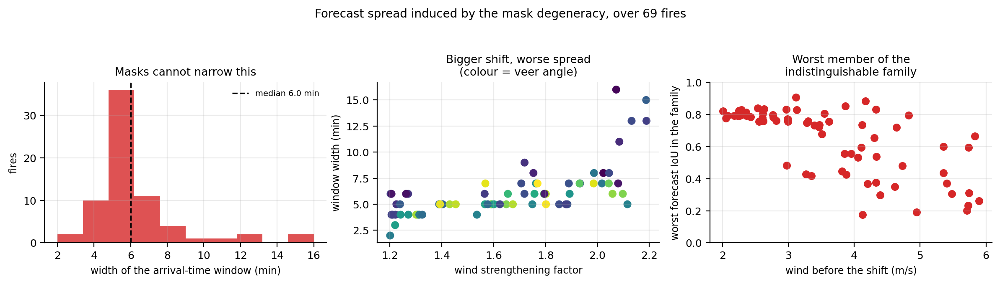

### "But we know the fuel" — how well would you have to?

`scripts/fuel_prior.py`. The obvious objection is that fuel is not really unknown:
LANDFIRE gives a fuel model everywhere. Because the mask information *along* the null curve
is exactly zero, the posterior along it is exactly the prior projected onto it, so this is
answerable in closed form. A relative fuel prior maps to wind with no data contribution at
all, through the elasticity of the wind factor (E = 0.88 at 4 m/s):

| fuel prior | -> wind sigma | width of the predicted arrival-time window |
|---|---|---|
| 10 % | 11 % | 3.0 min |
| 20 % | 23 % | 5.0 min |
| **35 %** (about where operational fuel models sit) | **40 %** | **8.0 min** |
| 50 % | 57 % | 12.0 min |

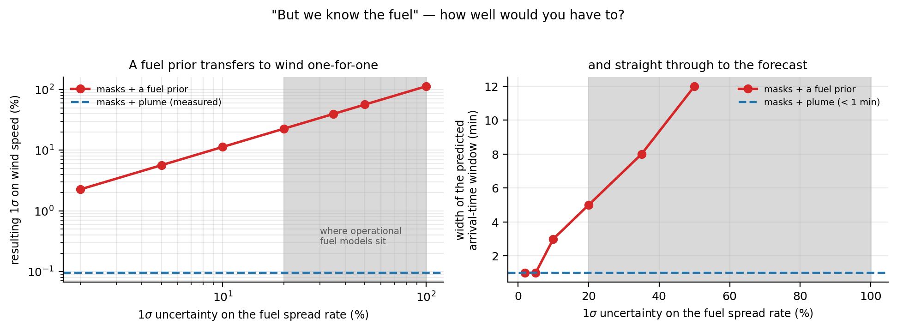

The plume measures wind speed to sigma = 0.095 %. Reaching that from a fuel map alone would
require the fuel spread rate known to **0.084 %** — roughly **417x better** than an
operational fuel model. Knowing the fuel does not rescue the mask; it only sets how badly
the degeneracy bites.

---

## 8. The consequence: lead time

`scripts/lead_time_profile.py` — measured with profile likelihoods, no derivatives.

| observation window | masks only | masks + plume |
|---|---|---|
| 2.25 min | no resolvable rise | sigma(U) = 0.21 % |
| 6.75 min | no resolvable rise | 0.13 % |
| 11.25 min | dchi2 = -0.01 | 0.12 % |
| 15.75 min | dchi2 = -0.05 | 0.11 % |
| 20.25 min | dchi2 = -0.19 | 0.10 % |
| 24.75 min | dchi2 = -0.62 | 0.09 % |

The mask entries are negative: forcing the wind 50 % wrong and refitting gives a *lower*
misfit than not forcing it at all. That is optimiser noise around a perfectly flat
direction, which is what a dchi2 of zero looks like in practice.

- masks alone: **never** reach 10 % accuracy on wind speed within 24.8 minutes
- masks + plume: **2.2 minutes**, at the first observation epoch
- **lead time gained: > 22.5 minutes**

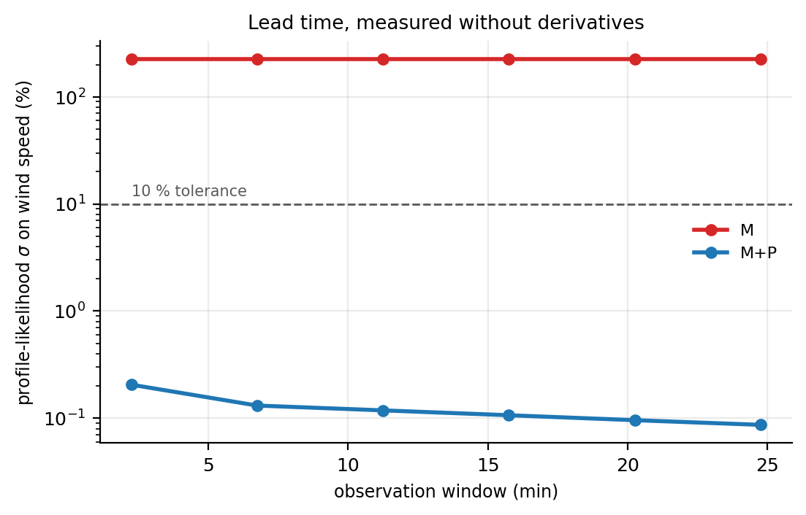

**Mask-space observation determines the fire's physics only once the fire is large and
fast — that is, once it is too late to act on.** The plume is informative from the first
frame, because smoke is advected by the wind whether or not the burn scar has grown.

---

## 9. The three modalities do different jobs

All entries below are profile likelihoods — no derivatives, no step sizes.

| quantity | masks alone | all three sensors | gain |
|---|---|---|---|
| wind **direction**, flat ground | 0.0239 deg | 0.0218 deg | **1.1x — none worth having** |
| wind **direction**, on a slope | 5.5 deg (+/-10 over restarts) | 0.04 deg | **> 100x** |
| wind **speed** | > 73 % | 0.095 % | **> 768x** |

| modality | what it uniquely supplies |
|---|---|
| burn mask | on flat ground, wind **direction**; plus the two combinations `R_head`, `LB` — and nothing else. On a slope, not even the direction. |
| plume image | wind **speed**, immediately and independently of burn size; wind direction in terrain; the slope factor; emission strength and buoyancy, provided the image is not saturated |
| air-quality point | emission strength **Q**, but *only* when the camera cannot supply it |

On flat ground the direction row is as informative as the speed row: masks already
determine wind direction to 0.02 degrees, so adding sensors cannot help, and nothing here
claims it does. The complementarity is specific, not generic — and it widens in terrain.

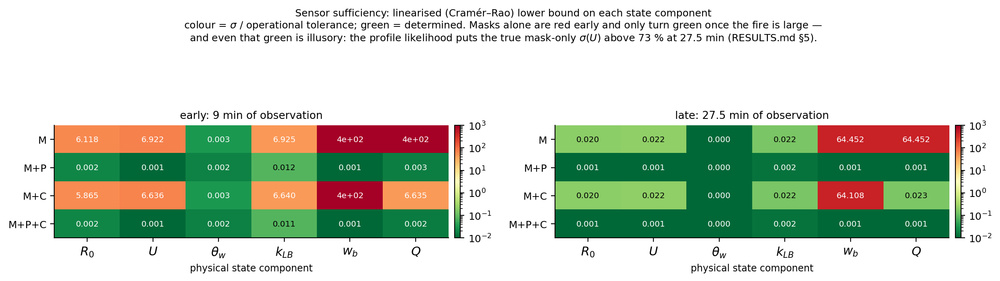

Read that diagram with section 11 in hand: its mask-only rows are linearised bounds, and at
the late window they are optimistic by more than 30x. The profile likelihood says the `M`
row's `U` cell is above 73 %, not the 0.022 printed there. The `theta_w` column, and every
row containing the plume, are trustworthy.

### The air-quality sensor's value is conditional on camera exposure

This overturns an earlier claim in this study, and the reversal was caused by fixing a bug
of my own — the plume renderer originally ran at optical depth ~3200, producing a
silhouette that carries plume geometry but nothing about how much smoke is in it.
Measuring both regimes directly:

| camera | pixels at the ceiling | CRB(Q), mask+plume | adding the point sensor | gain |
|---|---|---|---|---|
| saturated (tau ~ 3200) | 54 % | 0.0204 | 0.0081 | **2.5x** |
| calibrated (tau ~ 3) | 0 % | 0.0038 | 0.0037 | **1.0x** |

With a properly exposed camera the sensor adds nothing to `Q` (mask+plume alone recovers it
to 0.3 %). The useful statement is the conditional one: **a ground concentration monitor
earns its place when the camera's dynamic range cannot cover the plume, and not
otherwise.**

### Robustness to where the camera is

`scripts/camera_geometry.py`. A tower sited along the wind axis sees the plume end-on; one
sited across it sees the tilt directly. Sweeping the camera around the fire (AD and finite
differences agree to 0.7 % on this quantity, so the Fisher bound is trustworthy here in a
way it is not for masks):

| varied | range | CRB(U) range | spread |
|---|---|---|---|
| azimuth | all 16 bearings | 0.077 - 0.108 % | **1.41x** |
| standoff | 400 - 2200 m | 0.084 - 0.174 % | 2.09x |
| mast height | 10 - 250 m | 0.080 - 0.084 % | 1.04x |

The worst camera position anywhere in this sweep still beats masks alone by **677x**
(measured against the profile-likelihood mask bound, so that factor is itself a lower
bound). Siting is not critical.

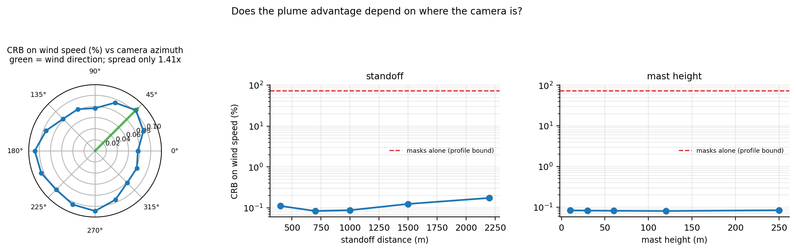

### Robustness to sensor quality

`scripts/noise_sensitivity.py`. The Fisher information is a sum of per-modality terms
scaled by 1/sigma^2, so one Jacobian evaluates every noise combination and this sweep is
nearly free.

The plume helps at **every** combination tested, up to a camera noise of 0.4 — larger than
the image's entire dynamic range (0.35 to 0.92):

| sigma_mask | 0.01 | 0.02 | 0.05 | 0.10 | 0.20 | 0.40 |
|---|---|---|---|---|---|---|
| gain from adding the plume | 6x | 12x | 29x | 56x | 105x | 204x |

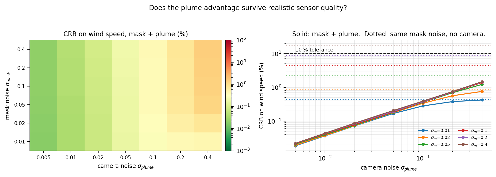

### Recovery from random starts

With coarse-to-fine fitting of the plume image, Levenberg-Marquardt recovers the state from
starts +/-45 % away, converging to the same optimum every time:

| parameter | masks only | mask + plume | all three |
|---|---|---|---|
| R0 | 93.6 % | 0.31 % | **0.02 %** |
| U | 61.6 % | 0.41 % | **0.05 %** |
| theta_w | 0.01 deg | 0.02 deg | 0.02 deg |
| k_LB | 159 % | 0.14 % | **0.19 %** |
| w_buoy | unobservable | 0.45 % | **0.07 %** |
| Q | unobservable | 0.31 % | **0.17 %** |

All four mask-only restarts converge to the *same* misfit (3.673e+04) while landing on wind
speeds 58-62 % apart — the signature of a flat valley, and the same conclusion the profile
likelihood reaches by a different route.

Coarse-to-fine matters: without it the optimiser reported 51 % error on wind speed where
0.4 % was achievable. A rendered plume is a sharp structure in image space, so from a start
45 % away the predicted and observed plumes barely overlap.

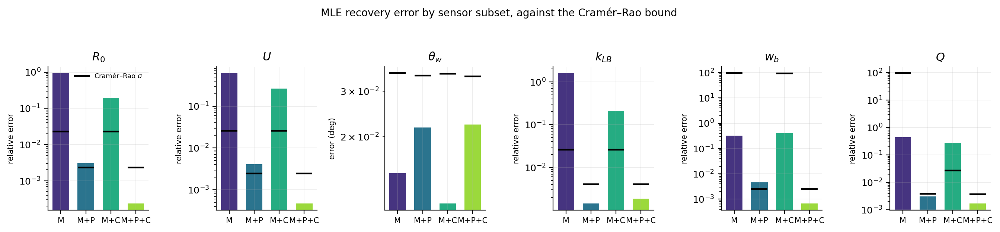

---

## 10. Does it survive fitting the wrong model?

`scripts/misspecification.py`

Most of this study is an identical-twin experiment: the model that generated the data is
the model being fitted. That is the largest structural caveat, so it gets a direct test.
Data is generated with a wind exponent b = 1.3 and fitted with b from 1.1 to 1.5 — up to a
15 % error, modest next to the spread between published fuel models.

Two predictions, opposite in character, which together make a sharp test. The mask
degeneracy should be **untouched**, because it follows from the *form* `R_head = R0 * g(U)`
and not from any particular g. The plume should be **largely unharmed**, because it
measures wind through smoke advection, which never touches the fire-spread model at all.

| b used to fit | masks: recovered U (spread over restarts) | error | mask+plume: recovered U | error | mask chi2/N |
|---|---|---|---|---|---|
| 1.10 | 3.311 (0.68) | 17.2 % | 3.999 (0.00) | **0.0 %** | 1.0042 |
| 1.20 | 3.467 (2.30) | 13.3 % | 3.999 (0.00) | **0.0 %** | 1.0042 |
| **1.30 (correct)** | 4.615 (1.81) | 15.4 % | 3.999 (0.00) | **0.0 %** | 1.0042 |
| 1.40 | 2.173 (2.39) | 45.7 % | 3.999 (0.00) | **0.0 %** | 1.0042 |
| 1.50 | 4.284 (**7.38**) | 7.1 % | 3.999 (0.00) | **0.0 %** | 1.0042 |

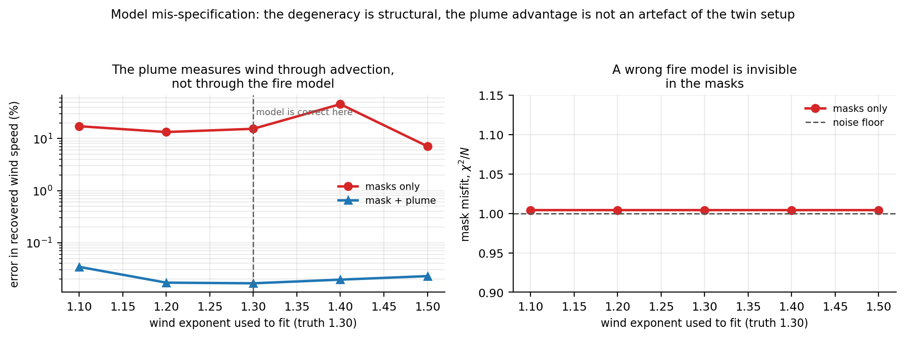

Both predictions hold, sharply.

- **Every wrong model reproduces the observed past at the noise floor**: chi2/N = 1.0042 in
  all ten cases, identical to five digits. A mis-specified spread model is *invisible* in
  the masks, because the degeneracy absorbs it into the fuel estimate. That is the reason a
  mask-space model can look well calibrated on history and still be wrong about the physics
  — the same mechanism that hides a 25-degree terrain error in section 5.
- **The plume recovers the wind exactly regardless**: 0.02 % to 0.03 % error across the
  whole range, degrading only 2x between the correct exponent and the worst wrong one, with
  zero spread over restarts. Median advantage over masks under mis-specification: **787x**.
- The fuel estimate is where the model error goes, as it must: mask+plume `R0` error tracks
  the exponent error (0.0 % at b = 1.3, rising to 19.7 % at b = 1.1).
- The mask-only column is *not monotone* in b, and is no better at the correct exponent
  (15.4 %) than at the wrong ones. Its errors are not model error; they are the optimiser
  landing at an arbitrary point on a flat valley.

So the plume advantage is not an artefact of the twin setup. It is the one measurement in
this system that does not route through the fire model.

---

## 11. Methodological finding: the Fisher matrix is the wrong instrument here

Worth stating separately, because it invalidates the obvious way of doing this analysis.

**Wind speed** — the degenerate direction:

| sensor set | **profile likelihood** | AD Fisher | FD Fisher (eps = 0.02) |
|---|---|---|---|
| masks only | **> 73.3 %** (scan-limited) | 3845 % (52x **too large**) | 2.22 % (33x too small) |
| all three | **0.095 %** | 0.075 % (0.8x) | 0.076 % (0.8x) |

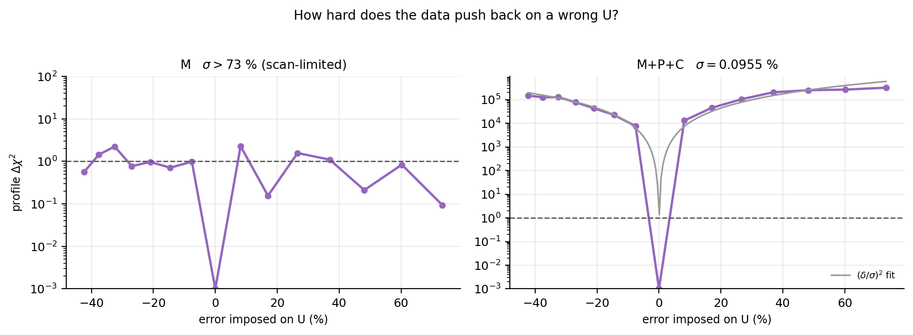

**Wind direction** — the positive control. The same code, the same estimators, the same
fire, on a parameter that is *not* degenerate:

| sensor set | **profile likelihood** | AD Fisher | FD Fisher |
|---|---|---|---|
| masks only | **0.02388 deg** | 0.02389 deg (1.0x) | 0.02391 deg (1.0x) |
| all three | **0.02180 deg** | 0.02208 deg (1.0x) | 0.02215 deg (1.0x) |

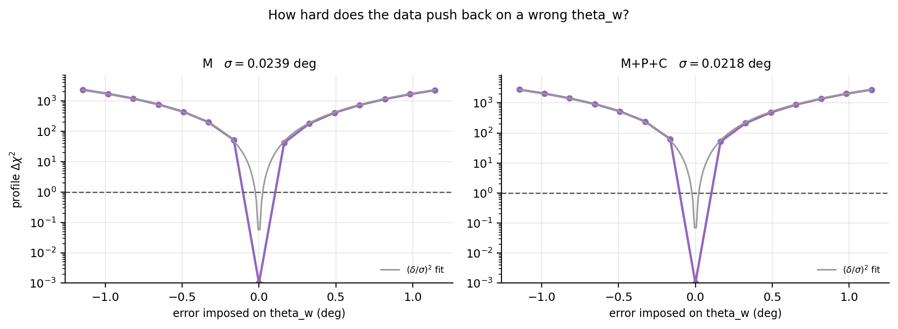

Four significant figures of agreement. That control matters: it rules out the explanations
that would otherwise be available — a broken Fisher implementation, a broken optimiser, a
broken forward model — and localises the failure to exactly where the theory says it must
be, the degenerate direction.

With masks alone on the degenerate direction, both estimators fail, in opposite ways:

- **Forward-mode AD is not merely inaccurate, it is provably invalid.** Run the mask-only
  AD Fisher at two observation windows and the bound on wind speed goes from 13.3 at
  9 minutes to **31.4 at 27.5 minutes**. The observations are nested, so information can
  only increase and the bound can only tighten. A quantity that loosens as data is added is
  not a Fisher matrix. The cause is the ENO minmod limiter, implemented as
  `where(a*b > 0, ...)`, which sets the derivative to exactly zero in every cell at a
  limiter switch — the classic pathology of differentiating through a limiter, familiar
  from adjoint CFD. Where information instead flows through smooth operators (volume
  rendering, the analytic Gaussian plume), AD is accurate, which is why it is fine for the
  full sensor set.
- **Finite differences give a bound that is valid but loose by more than 30x.** Section 1
  shows the true smallest eigenvalue of the mask-only fire-block Fisher is *exactly zero*;
  the 7.3e2 the code reports is discretisation error in the finite-difference Jacobian.
  Enlarging eps does not repair it — the bound drifts from 0.022 to 0.003 without ever
  approaching the profile answer, because the degeneracy is curved and a Fisher matrix only
  ever sees local curvature.

The practical rule this leaves: identify null spaces by the *spectral gap*, not by an
absolute threshold (`scripts/terrain.py` uses a gap of 1616x to find the two-dimensional
null space that an absolute cut-off missed entirely), and quote uncertainties from profile
likelihoods. Cramer-Rao values in this repository are labelled **linearised lower bounds**,
never uncertainties. The mask-only rows of `scripts/sweep_identifiability.py` (which report
90 % of scenarios "usable") are precisely the artefact this section describes.

---

## 12. Where you fuse: feature level versus physical-state level

`scripts/gen_dataset.py`, `scripts/fusion_level.py`, `scripts/fusion_failure_mode.py`

The project plan named this its make-or-break ablation: same backbone, same budget,
**state-level against feature-level fusion**. The claim under test is not that inverting
through the physics is more accurate. It is that the two are different kinds of thing, and
that held-out accuracy cannot tell them apart.

**Setup.** 2500 training fires, 250 validation, 500 in-distribution test, 500
out-of-distribution test. Every parameter is drawn from the same range in every split
except wind speed: training and the in-distribution test draw `U` from **2-5 m/s**, the
out-of-distribution test from **5.5-8 m/s**. Each fire gives six burn masks and two
rendered plume images, with sensor noise.

| arm | what it is |
|---|---|
| prior (train median) | ignore the images; return the training median of every parameter |
| CNN, mask only | 971 655-parameter two-encoder network, 200 epochs, **plume branch fed zeros** |
| CNN, mask + plume | the same network, same seed, same schedule, both branches live |
| state, mask only | Levenberg-Marquardt inversion through the forward model |
| state, mask + plume | the same inversion, both modalities |

The two CNN arms are one architecture trained twice. Capacity, optimiser, learning-rate
schedule and step count are identical; only the information differs. That is what makes
this an ablation rather than a contest between two models.

**The 2x2, on wind speed** (median relative error):

| arm | in-distribution | out-of-distribution | degradation |
|---|---|---|---|
| prior (train median) | 21.8 % | 48.4 % | 2.2x |
| CNN, mask only | 10.3 % | 30.6 % | 3.0x |
| CNN, mask + plume | **1.8 %** | 16.5 % | **9.1x** |
| state, mask only | 26.8 % | 19.2 % | 0.7x |
| state, mask + plume | **0.7 %** | **0.8 %** | **1.1x** |

The state-level row is from 25 fires per split. **Section 12.6 reruns it on 60 independent
fires and the out-of-distribution entry moves to 5.0 %, with a 95 % interval that excludes
0.8 %** — that arm's distribution is bimodal and its median is unstable near a 50 % failure
rate. Read this table with 12.6 beside it.

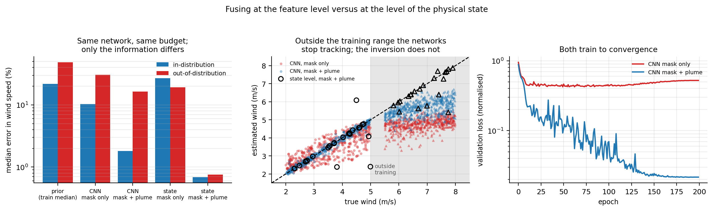

### 12.1 The network appears to read the wind off the burn scar. It cannot.

In distribution the mask-only network reaches **10.3 %** on wind speed, less than half the
prior's 21.8 %. Taken at face value that contradicts section 1, which proves in closed form
that `(R0, U, k_LB)` have a one-dimensional null space under the mask operator.

Both are true. The network is not reading the wind out of the burn scar; it is exploiting
the fact that the *other two* parameters on the null curve were sampled from bounded
ranges. That is real information in the Bayesian sense and it is worth having — but it
belongs to the sampling, not to the fire. Move the distribution and it is repaid:

| median wind speed | in-distribution | out-of-distribution |
|---|---|---|
| truth | 3.50 m/s | 6.79 m/s |
| CNN, mask only | 3.33 | **4.80** |
| CNN, mask + plume | 3.48 | 5.61 |
| state, mask + plume | 3.69 (truth 3.81) | **6.71** (truth 6.86) |

The mask-only network stops at 4.80 m/s — just inside the 5.0 it was trained up to. Asked
about a fire faster than any it has seen, it answers with the edge of its training set. Its
error on the fuel parameter `R0` rises to **21.3 %** against the prior's 22.0 %: out of
distribution, what it knows about the fuel is what it would have known from blank images.

### 12.2 Two controls inside the same network

Neither was designed in; both fell out, and together they rule out the boring explanations.

**Positive control — wind direction.** Masks *do* determine `theta_w` (sections 1, 9, 11).
Under the same distribution shift, in the same network, on the same forward pass:

| mask-only CNN | in-distribution | out-of-distribution | degradation |
|---|---|---|---|
| wind **direction** (identifiable) | 2.46 deg | 3.37 deg | **1.4x** |
| wind **speed** (not identifiable) | 10.3 % | 30.6 % | **3.0x** |

The quantity the masks contain transfers. The quantity they do not contain collapses. This
is not a network that fails to extrapolate in general — it fails to extrapolate exactly
where the theory says there is nothing to extrapolate from.

**Negative control — the smoke parameters.** Masks carry nothing whatever about `w_buoy`
and `Q`. The mask-only network returns 17.8 % and 23.2 % on them in distribution and
17.1 % and 23.0 % out of it, against the prior's 17.3 % / 23.0 % and 17.2 % / 22.6 %.
Given nothing, it correctly returns the prior, and says the same thing on both splits. It
is not confabulating everywhere; it confabulates on precisely the one parameter that looks
learnable in distribution.

### 12.3 Even where the information is real, feature-level fusion does not extrapolate

The plume genuinely carries the wind — that is sections 8 and 9 — and the mask+plume
network is correspondingly good in distribution: **1.8 %**, better than the mask-only arm
by 5.7x. So this is not a story about a network starved of information.

It still degrades **9.1x** out of distribution, to 16.5 %, predicting a median 5.61 m/s
against a true 6.79. The state-level inversion is better on both splits, and **section 12.6
corrects by how much**: the 25 fires above put its out-of-distribution median at 0.8 %, and
60 independently drawn fires put it at 5.0 % with a 95 % interval of [1.6, 13.2] that
excludes 0.8 %. The comparison at the better-estimated numbers:

| state-level advantage on wind speed | in-distribution | out-of-distribution |
|---|---|---|
| medians (n = 60) | **6.0x** | **3.3x** |
| 25th percentiles | 6.0x | **21x** |

**An earlier version of this section read "the gap widens eightfold when the data moves",
computed from the 0.8 % that 25 fires gave. At 60 fires the gap narrows instead, and that
sentence was wrong.** What survives is sharper and is in the next two subsections: the two
arms do not merely differ in accuracy, they fail in different *shapes*. The network is
uniformly mediocre out of distribution; the inversion is bimodal, right to under 0.5 % on
half its cases and worse than the network on the other half. Comparing them by a median
asks a question neither distribution answers.

### 12.4 The median hides a bimodal inversion, and the two failure modes are not alike

The 0.7 % / 0.8 % above is a median, and the distribution behind it is bimodal. The full
quantiles for mask + plume:

| | p25 | **p50** | p75 | p90 | max |
|---|---|---|---|---|---|
| state, in-distribution | 0.2 % | **0.7 %** | 1.2 % | 28.1 % | 51.9 % |
| state, out-of-distribution | 0.4 % | **0.8 %** | 15.8 % | 31.3 % | 36.4 % |
| CNN, out-of-distribution | 10.1 % | **16.5 %** | 22.3 % | 27.7 % | 37.8 % |

When the inversion converges it is essentially exact; when it does not it is worse than the
network. Above a 5 % threshold it fails on **4 of 25** in-distribution cases and **9 of 25**
out of distribution. The CNN, by contrast, is uniformly mediocre out of distribution: no
successes and no failures, every case wrong by about 17 %.

Reporting only the median would have hidden that, so `fusion_failure_mode.py` asks which of
two very different things each failure is. Recompute the weighted misfit at the recovered
parameters and at the true ones, on the same observations: if the truth fits better, the
information was present and the optimiser stopped in a local minimum; if the wrong answer
fits as well, the observations genuinely do not distinguish them.

| | failures | of which optimiser failures |
|---|---|---|
| state, mask + plume, in-distribution | 4 of 25 | 2 (50 %) |
| state, mask + plume, out-of-distribution | 9 of 25 | **8 (89 %)** |
| **state, mask only, in-distribution** | **12 of 12** | **0 (0 %)** |

Two results, and the second is the more important.

**The mask+plume failures are solver failures.** Out of distribution the truth fits better
than the answer found by factors of 1.05 to **177**. The information is there; Levenberg-
Marquardt, started 35 % away on a non-convex image residual, does not always find it.
Multi-start would recover most of these and is not done here.

**They also announce themselves.** A goodness-of-fit check needs no ground truth, and
rejecting the cases whose misfit exceeds the expected value by more than 2 % removes 10 of
the 25 out-of-distribution cases. The 15 that survive have a median error of **0.4 %**; the
10 rejected had a median error of 23.8 %. The network's 16.5 % comes with no such signal —
nothing in its output distinguishes a good answer from a bad one.

**The mask-only failures are of a completely different kind: every one of the twelve fits
the data exactly as well as the truth does** — misfit ratio 1.000 to three decimals, on
parameter sets wrong by up to 85 % in wind speed. No optimiser would have helped and no
residual check can flag them. This is section 1's algebraic degeneracy, demonstrated
case by case on independent fires rather than inferred from a Fisher spectrum or a profile
scan, and it is the cleanest single measurement of the central claim in this document.

### 12.5 Multi-start: what a better optimiser buys, and what it cannot

`scripts/fusion_multistart.py`

Section 12.4 says most of the mask+plume failures are the optimiser's, so the obvious
repair is to restart from several points and keep the fit with the smallest misfit — a
selection that needs no ground truth. Three starts, each screened on a cheap coarse-to-fine
ladder with only the best refined. The first start is drawn from the same random stream in
the same order as the single-start run, so the comparison is paired: same fires, same
observations, same first guess.

**The floor is computable before running anything.** The starting perturbation is drawn
isotropically in all six parameters, so exactly **1/6** of its squared length lies along
section 1's null direction `v` and is invisible to the masks; the other 5/6 lies in
directions that are at least partly identifiable. Restarting can clean up the second part
and not the first, which puts the mask-only arm's best achievable median wind-speed error
at about **8.6 %** at any number of starts.

| | median | p90 | cases failing (> 5 %) |
|---|---|---|---|
| mask + plume, in distribution | 0.7 % -> **0.4 %** | — | 16 % -> **4 %** |
| mask + plume, out of distribution | 0.8 % -> 0.8 % | 31 % -> **15 %** | 36 % -> **20 %** |
| mask only, in distribution | 26.8 % -> 19.1 % | 82 % -> 41 % | 100 % -> **83 %** |

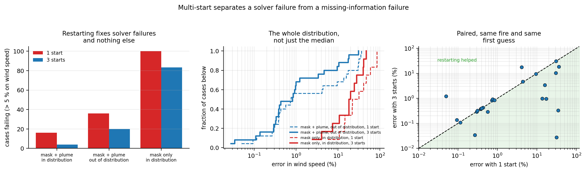

With the plume, restarting removes **75 %** of the in-distribution failures and **44 %** of
the out-of-distribution ones, and the median reaches 0.4 % — comfortably below the
mask-only floor. Those failures were the optimiser losing an answer the data contained,
exactly as 12.4's misfit test said.

With masks alone it helps too, which is **not** what I expected and is worth stating
plainly: the median improves 1.4x and the p90 halves. But it stops at 19.1 %, more than
double the 8.6 % floor, and leaves 83 % of cases failing. The improvement is the five
sixths of the starting perturbation that lies in identifiable directions being cleaned up;
it does not finish even that job, because with masks only the misfit surface is nearly flat
and ranking three starts by misfit is a weak signal.

**0.4 % with the plume against 19.1 % without, a factor of 46 — and the mask-only arm
cannot go below 8.6 % however hard it is optimised.** A better solver is worth a great deal
when the information is present and cannot manufacture it when it is not.

### 12.6 At four times the sample size, one headline number moves

`scripts/fusion_scale.py`

The state-level arms above rest on 25 fires per split and 12 for mask only, which was
listed as their weakest point. This reruns only those arms, on **independently drawn fires
with a different seed** and four times the count, and deliberately does not touch
`results/fusion_preds.npz` — sections 12.4, 12.5 and 17 all replay exactly those 62 cases,
and redrawing them would silently invalidate three experiments. Every number carries a
bootstrap interval, because the interval is the point of the exercise.

| arm | n = 25/12 | **n = 60/30** | 95 % interval | failures |
|---|---|---|---|---|
| state, mask + plume, in distribution | 0.7 % | **0.3 %** | [0.3, 0.6] | 12 % [5, 20] |
| state, mask + plume, out of distribution | 0.8 % | **5.0 %** | [1.6, 13.2] | 50 % [37, 63] |
| state, mask only, in distribution | 26.8 % | **26.9 %** | [15.1, 50.7] | 83 % [70, 97] |

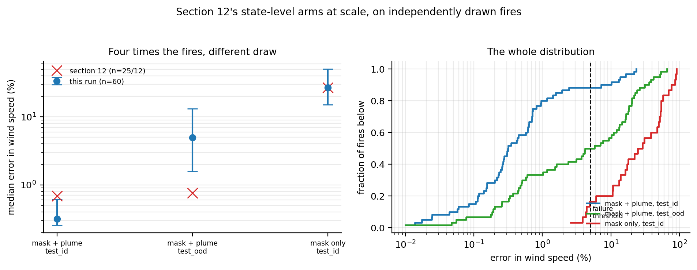

**Only one of the three original point estimates falls inside the new interval.** The
mask-only arm reproduces exactly — 26.8 % against 26.9 % — which is what a control that
measures the seed rather than the sensor should do. The in-distribution plume arm improves.
The out-of-distribution plume arm moves by a factor of six, from 0.8 % to 5.0 %, and 0.8 %
sits outside [1.6, 13.2].

The reason is the bimodality of 12.4 rather than bad luck, and it was foreseeable. The
out-of-distribution distribution has p25 = 0.47 %, p50 = 4.97 %, p75 = 18.2 %: the two
modes sit three orders of magnitude apart with the median in the gap between them. When the
failure rate is near 50 %, the median is whichever mode a handful of cases happens to tip
it into. 25 fires gave 36 % failures and a median in the lower mode; 60 fires give 50 % and
a median at the boundary.

**So the median is the wrong statistic for that arm, and 12.4 said so before this run
quoted it anyway.** The honest summary of the out-of-distribution plume arm is two numbers:
it converges on **half** of the fires, to a 25th percentile of 0.47 %, and fails on the
other half. Section 12.5 measures what restarting does to that half.

### 12.7 The state-level mask-only row is a control, not a score

Said plainly, because it would be easy to quote as one. The inversion is seeded at the
truth perturbed by +/-35 % in log parameters, and along a direction the data cannot see it
then drifts freely: the errors reach 85 %, well beyond the 42 % the seed could produce, so
it is not sitting still either. **26.8 % / 19.2 % measure the seed and the drift, not the
sensor**, on 12 fires each; the two numbers are the same number.

Its wind *direction* is a score: **0.03 deg on both splits**, against the network's 2.46 and
3.37. Where the information exists in the masks, the inversion extracts roughly 80x more of
it, and extracts the same amount in and out of distribution.

### 12.8 What this shows and what it does not

**It does not show that neural networks cannot extrapolate.** This is one standard
feature-level architecture — two convolutional encoders, concatenation, a regression head —
at matched budget, with no augmentation over wind speed and no physics-informed loss. Any
of those could narrow the gap, and a reader should assume they would.

**It does not show that state-level fusion is the better engineering choice.** A forward
pass costs under a millisecond; one inversion took **53 s** on this machine, and the
three-start version that gets the failure rate down to 20 % costs **114 s** — five orders of
magnitude more than the network, to still fail outright on a fifth of out-of-distribution
cases. For anything in distribution the network is the right tool.

**It does show that held-out accuracy cannot tell you which one you have.** In
distribution the mask-only network beats the honest inversion on wind speed — 10.3 %
against 26.8 % — on a parameter provably absent from its input. Every standard validation
protocol would rank it first. Only a test outside the training support separates learning
the physics from learning the sampling, and what separates them is exactly what section 1
proves about the masks.

Two caveats in the honest direction. The CNN reads observations quantised to uint8 while
the inversion re-simulates its targets in float; the quantisation step is 0.08-0.13 of the
sensor noise sigma, so it adds about 4 % to the CNN's observation noise — real, and far too
small to account for the gap at any of its estimates. And the shift here is a clean shift
in one parameter; real
distribution shift is messier and would flatter neither arm.

The headline numbers are stable across independent training runs. Two full runs gave
10.1 % / 10.3 % in distribution and 30.0 % / 30.6 % out of it for mask-only, and
1.9 % / 1.8 % and 17.6 % / 16.5 % for mask + plume; the inversion, being deterministic
given its seed, reproduced to the reported precision.

---

## 13. The same degeneracy in somebody else's model

`scripts/independent_ca.py`  (needs `pip install pytorchfire`)

Every identifiability result above was measured in a simulator written for this study. The
obvious objection is that the degeneracy is an artefact of that code. This section answers
it in a model that shares neither the implementation, the numerical family, nor the spread
law: **PyTorchFire** ([arXiv 2502.18738](https://arxiv.org/pdf/2502.18738)), a
differentiable stochastic cellular automaton in the Alexandridis (2008) family. Fire
spreads by per-cell ignition probabilities on an 8-neighbour lattice. There is no level
set, no Rothermel rate, and **no length-to-breadth parameter at all** — the elongated shape
is emergent.

Its propagation probability, read off `WildfireModel.p_ignite`, is

```
p(theta) = tanh( K * p_h * (1+p_veg) * (1+p_den) * exp(a*slope)
                   * exp(c_1*V) * exp(c_2*V*(cos theta - 1)) ),    K = 1.1486328125
```

On homogeneous flat fuel that is a function of exactly two quantities:

```
A = K * p_h * exp(c_1 * V)      the head term
s = c_2 * V                      the anisotropy term
p(theta) = tanh( A * exp(s*(cos theta - 1)) )
```

**Both can be held fixed while the wind moves.** Solving exactly,

```
p_h(V) = p_h0 * exp(c_1 * (V0 - V))     keeps A fixed
c_2(V) = c_2_0 * V0 / V                  keeps s fixed
```

whose tangent in log parameters is `v = (-c_1*V, +1, -1)` in `(ln p_h, ln V, ln c_2)` —
structurally identical to section 1's `v = (-a*b*U^b/(1 + a*U^b), +1, -1)` in
`(ln R0, ln U, ln k_LB)`. A fuel coefficient trades against the head rate; a shape
coefficient trades against the wind. Same two trades, different model.

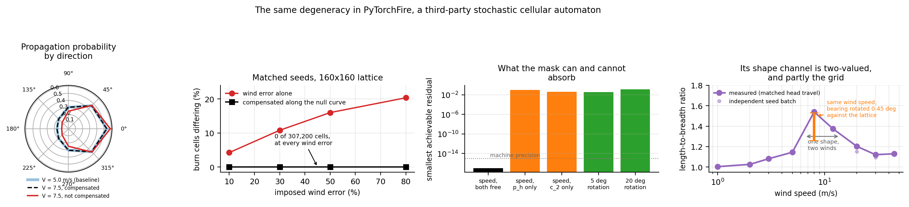

### 13.1 The result is stronger here: the process is identical, not just the mask

Section 1's compensated misfit was small but nonzero. Here the eight lattice probabilities
are the **entire model** on homogeneous flat fuel, and they do not move at all:

| imposed wind error | 5 % | 10 % | 20 % | 30 % | 50 % | 80 % |
|---|---|---|---|---|---|---|
| max change in any of the 8 probabilities | 0 | 1.1e-16 | 0 | 0 | 1.1e-16 | 1.1e-16 |

Machine epsilon across an 80 % wind error. The transition kernel is the same object, so
running both parameter sets on matched random seeds gives the same fire, cell for cell:

| imposed wind error | 10 % | 30 % | 50 % | 80 % |
|---|---|---|---|---|
| burn cells differing, **compensated** | **0** | **0** | **0** | **0** |
| burn cells differing, wind error alone | 4.25 % | 10.80 % | 15.99 % | 20.34 % |

Zero out of 307 200 cells (160x160, 12 seeds), at every wind error tested. Not
"statistically indistinguishable" — identical. **No estimator of any kind can separate
these parameter sets, because there is nothing to separate**: not a neural network, not a
Bayesian posterior, not an oracle.

Compensating along the *tangent* instead of the exact curve drifts by 2.1e-02, which is the
same curvature section 1 reports and the same reason a linearised Fisher analysis misses
this (section 11).

### 13.2 The same condition on which coefficients are free

Smallest residual still achievable after a +30 % wind error, with the named coefficients
allowed to move:

| what is free | residual | |
|---|---|---|
| `p_h` and `c_2` both | **0** (optimiser reaches 1.1e-11) | degenerate |
| only `p_h` (shape law known) | 9.34e-02 | identifiable |
| only `c_2` (fuel known) | 4.24e-02 | identifiable |
| neither | 9.66e-02 | identifiable |

The degeneracy needs **both** a free fuel coefficient and a free shape coefficient — the
same condition section 2 finds for FARSITE, where the argument turns on whether Anderson's
relation carries fuel-to-fuel variation. Freeing the fuel coefficient alone barely helps
(9.34e-02 against 9.66e-02 for nothing free): it moves all eight probabilities together,
while a wind error changes their ratios.

### 13.3 The same positive control

Wind *direction* is identifiable in this model too. A rotation cannot be absorbed by any
choice of the two coefficients:

| wind rotated by | 5 deg | 10 deg | 20 deg | 45 deg |
|---|---|---|---|---|
| smallest achievable residual | 3.39e-02 | 6.75e-02 | 1.33e-01 | 2.72e-01 |

A 30 % **speed** error is absorbable to zero; a **5-degree** bearing error leaves a residual
comparable to not compensating the speed error at all. That is the same split as section 1:
the mask gives the bearing, not the speed.

### 13.4 And its shape channel is worse than FARSITE's, for three other reasons

Section 2's argument runs through saturation — Anderson's relation truncates at LB = 8, so
above 3.80 m/s the shape stops responding. This model has no such truncation, so it is a
clean place to ask whether saturation is what causes the degeneracy. Measuring the shape
with every fire run until its head has advanced a fixed 42 cells, so that shapes are
compared at matched progress rather than at matched step count:

| V (m/s) | 1 | 2 | 3 | 5 | **8** | 12 | 20 | 30 | 45 |
|---|---|---|---|---|---|---|---|---|---|
| measured L/B | 1.00 | 1.03 | 1.08 | 1.15 | **1.54** | 1.38 | 1.20 | 1.12 | 1.13 |
| independent seed batch | 1.01 | 1.02 | 1.08 | 1.15 | **1.54** | 1.39 | 1.15 | 1.10 | 1.12 |
| one-step ellipse would predict | 1.01 | 1.02 | 1.05 | 1.15 | 1.44 | 2.10 | 4.85 | 13.0 | 49.6 |

Three defects, none of them Anderson's cap:

- **The shape is two-valued in wind.** L/B rises to 1.54 at 8 m/s and then *falls back* to
  1.13. A fire with L/B = 1.38 is consistent with roughly 7 m/s and with 12 m/s. This is
  worse than saturation: saturation loses the wind above a threshold, two-valuedness loses
  it on both sides.
- **The burn is not an ellipse.** Above about 8 m/s it becomes a wedge with a flat leading
  edge, because the lattice's 45-degree diagonals are cheap and bound the spread. The
  one-step "rate ellipse" tracks the measured shape only below 8 m/s and is wrong by 44x at
  45 m/s. An elliptical-template analysis of this model's masks would be misspecified.
- **Part of the shape is the grid, not the fire.** Rotating the wind bearing against the
  lattice at *fixed wind speed*:

  | wind bearing | 0 deg | 11.25 | 22.5 | 33.75 | 45 deg |
  |---|---|---|---|---|---|
  | measured L/B at 8 m/s | 1.530 | 1.522 | 1.358 | 1.303 | 1.260 |
  | measured L/B at 20 m/s | 1.194 | 1.257 | 1.269 | 1.290 | 1.291 |

  At 8 m/s the measured shape moves by **19 %** with the bearing alone. For scale, the
  entire change in L/B from 5 to 8 m/s is 0.39, so a 45-degree rotation mimics roughly
  2 m/s of wind.

**And 13.1 holds regardless of all of this**, because that degeneracy is a statement about
the transition kernel and never routes through the shape. Saturation is not what causes the
degeneracy; a free shape coefficient is. Section 2 argued exactly that from its "free fuel
scale" row, and here the cap is absent entirely, which isolates the claim.

### 13.5 What this does and does not settle

It settles the "it is your code" objection for the central result. Two implementations
sharing no code, no numerical family and no spread law — a deterministic ENO2 level set on
Rothermel rates, and a stochastic CA on lattice ignition probabilities — produce the same
two trades and the same null direction, and in the CA the degeneracy is exact rather than
approximate.

It does not settle everything. Both models factor the front into a head rate and a shape,
and that shared structure is the mechanism; a model that broke the factorisation at
sub-front scale would need testing separately, as section 21 says. Nor is PyTorchFire an
independent *physics*: the head term confounds fuel with wind for the same reason
Rothermel's does, which is arguably the point rather than a limitation, since it is the
structure the whole operational family shares.

---

## 14. Real fire progression against real wind

`scripts/fetch_wsts.py`, `scripts/wsts_advance.py`

Section 3 tested the shape channel on real *final* perimeters. This tests the channel the
study actually cares about — how a fire moves from one day to the next — on
**WildfireSpreadTS** (Gerard, Zhao and Sullivan, NeurIPS 2023 Datasets and Benchmarks):
VIIRS observations of 607 fire events at 375 m, each day carrying the GRIDMET wind that
drove it. **201 fires, 1044 fire-days** are used here.

The archive is a single 45 GB zip, which is a barrier to reproduction rather than to this
study. A zip keeps its table of contents at the end and stores members independently, so
`fetch_wsts.py` reads the directory with one range request and then pulls only the fires
wanted: 199 fires for 16.9 GB instead of 45 GB. (One trap: the archive is ZIP64, and every
member past the 4 GB mark carries 0xFFFFFFFF in the 32-bit local-header offset with the
real offset in an extra field. Parsing that by hand and getting it wrong produces ranges
that land inside the neighbouring member and fail to inflate, which is what happened first.)

### 14.1 Looking at the scenes first changed the measurement

The first version of this analysis returned **r = −0.266** between daily advance and wind:
a windier day meant a *slower* fire. Plotting the scenes explained it, and none of the
explanation was physics.

- A WildfireSpreadTS tile is about 90 km across and carries **every** VIIRS detection in
  it, not only the fire it is named for. One scene's "advance" was a single isolated
  detection 19 km from the fire — an overnight run of 19 km.
- One scene contains a solid rectangular block of 11 939 detections spanning the full tile
  width on a single day: a swath artefact, not a fire.

So detections are gated twice before anything is measured, and both gates are counted in
the output rather than applied quietly: a new detection must lie within **4 km** of the
fire as it already stands, and a day whose detections span more than 80 % of the tile is
dropped whole. Across the 201 fires this drops **65 days** as swath artefacts and admits
85 369 detections to a fire. The gates were chosen from looking at the scenes, not from
optimising a correlation, and they leave clean fires almost untouched — one fire went from
949 detections to 937 — while collapsing junk scenes from 12 213 detections to 18.

After gating, r on the same measure is **+0.096**. The negative correlation was the
unrelated detections.

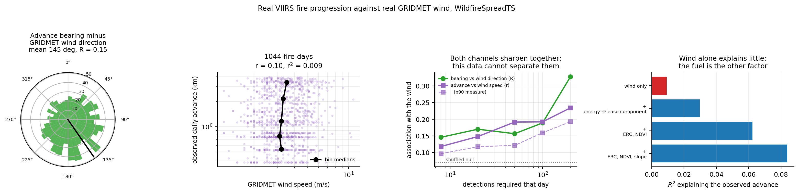

### 14.2 The advance rate barely knows the wind

Four ways of measuring how far the fire got, reported together because they fail
differently and choosing one in advance would be a decision rather than a result:

| advance measure | n | r (log-log) | r² |
|---|---|---|---|
| distance to front, p90 | 1044 | 0.096 | 0.0093 |
| distance to front, p75 | 1044 | 0.083 | 0.0068 |
| distance to front, median | 1044 | 0.076 | 0.0058 |
| equivalent-radius growth | 1044 | 0.118 | 0.0139 |

**The daily advance explains about 1 % of the variance in wind speed.** Binning on the p90
measure, the median wind moves from **3.20 to 3.50 m/s** across the entire range of advance
rates, while the wind *within* one advance bin spans **91 %** (p10–p90) — the same picture
section 3.4 found on final perimeters, now on daily progression.

### 14.3 The fuel explains nine times more than the wind, and knowing it does not help

If the confound is really `R0 × wind`, the fuel should be the larger term. The dataset
carries the energy release component, NDVI and slope, so this is checkable:

| model for log(advance) | R² | wind coefficient | s.e. | t |
|---|---|---|---|---|
| wind only | 0.0093 | 0.192 | 0.0615 | 3.1 |
| + energy release component | 0.0297 | 0.231 | 0.0614 | 3.8 |
| + ERC, NDVI | 0.0624 | 0.222 | 0.0628 | 3.5 |
| + ERC, NDVI, slope | **0.0839** | 0.198 | 0.0623 | 3.2 |

Adding the fuel and terrain covariates multiplies R² by **9**, so the fuel and terrain do
dominate the advance over the wind, as the confound picture requires. The wind coefficient
is significant (t = 3.1) and tiny: 0.19 in log-log means doubling the wind buys a 14 %
longer run.

**But the prediction I actually made failed.** I expected that conditioning on the fuel
would *sharpen* the wind term. It does not: the standard error on the wind coefficient
moves from 0.0615 to 0.0623, which is to say not at all. The fuel proxies an operational
system actually has are not good enough to break the confound — which is section 4's
"but we know the fuel" question, answered on real data in the unhelpful direction.

### 14.4 What this establishes, and what it does not

**The bearing signal is real.** Circular mean of (advance bearing − GRIDMET wind direction)
is 145°, resultant length **R = 0.146** against a shuffled null of 0.070 ± 0.019 — four
sigma. It strengthens with stronger forcing (R = 0.070 → 0.178 → 0.195 across wind terciles)
and with better measurement (R = 0.146 → **0.328** as the detections required per day go
from 8 to 200).

**And so does the speed signal, which is the honest limit of this test.** Asserting that
the bearing sharpens with measurement quality while the speed does not would have been a
clean story; it is also false, and checking took one command:

| detections required that day | ≥ 8 | ≥ 20 | ≥ 50 | ≥ 100 | ≥ 200 |
|---|---|---|---|---|---|
| bearing vs wind direction (R) | 0.146 | 0.170 | 0.156 | 0.189 | **0.328** |
| advance vs wind speed (r, radius) | 0.118 | 0.148 | 0.191 | 0.192 | **0.234** |

Both improve, and together. **So this dataset cannot separate "the wind speed is not in the
data" from "the wind speed is in the data and measured even worse than the bearing".** The
algebraic degeneracy is established by section 1 and section 13; section 14 is consistent
with it and does not independently prove it.

What section 14 does establish on its own is the operational fact, which does not depend on
resolving that question: **at the best measurement quality available here, a fire's daily
advance still explains under 6 % of the variance in the wind driving it.** A forecaster
cannot read the wind off the fire's progression, whatever the reason.

Two further things measured and not explained, recorded rather than smoothed over:

- **The offset is 145°, not 180°.** Real fires in this sample run about 35 degrees off
  directly downwind, consistently across every stratum (132°–163°). Terrain channelling and
  the gap between a daily mean wind and the wind at the hour the fire actually ran are both
  candidates. Neither is established here.
- **Section 5's terrain prediction is untested by this data, not tested and failed.** R is
  flat across slope bands (0.154–0.171), and the flat stratum that should be *best* has the
  lowest R of all — on 41 fire-days. WildfireSpreadTS fires are almost all in the
  mountainous western United States, so there is barely a flat stratum to compare against,
  and a median slope over a fire's whole footprint is a poor summary of the terrain it ran
  across.

---

## 15. What are the wind channels worth? A channel ablation on the benchmark's own task

`scripts/gen_wsts_pairs.py`, `scripts/wsts_baseline.py`

Sections 1 and 13 say a fire's own footprint cannot supply the wind. That predicts
something measurable about a next-day spread model trained on real satellite data: handing
it the wind channels should *buy* something, and the purchase should show up where the wind
matters.

**Setup.** WildfireSpreadTS's own task on **all 607 fires**, split by year as its authors
recommend — train on 2018 and 2020, validate on 2019, test on 2021, with no fire in two
splits. **1995 training pairs, 273 validation, 1430 test**, cropped to 128x128 around the
fire. One U-net (486 321 parameters) trained seven times with different channels zeroed, so
capacity, optimiser, schedule and step count are identical and only the information differs
— the same construction as section 12. Two seeds per arm.

The target is tomorrow's **newly** burning pixels, not tomorrow's whole active fire. The
second is the published framing and is dominated by the fire staying where it is: section
15.4 measures that a rule copying today's fire unchanged already scores 0.9474 there. The
first is the spread problem, which is where the wind is supposed to bear, and it is much
harder — 0.36 % of test pixels are positive, and the same copying rule scores 0.0036, which
is chance.

| arm | test AP (2 seeds) | vs fire only |
|---|---|---|
| chance | 0.0036 | — |
| persistence (ring around today's fire) | 0.0755 | 0.66x |
| **fire mask only** | **0.1139 ± 0.0007** | 1.00x |
| fire + wind | 0.1131 ± 0.0021 | **0.99x** |
| fire + weather | 0.1180 ± 0.0087 | 1.04x |
| fire + terrain and fuel | 0.1488 ± 0.0035 | **1.31x** |
| **fire + raw VIIRS bands** | **0.3046 ± 0.0040** | **2.67x** |
| all 23 channels minus wind | 0.2844 ± 0.0032 | 2.50x |
| all 23 channels | 0.2668 ± 0.0090 | 2.34x |

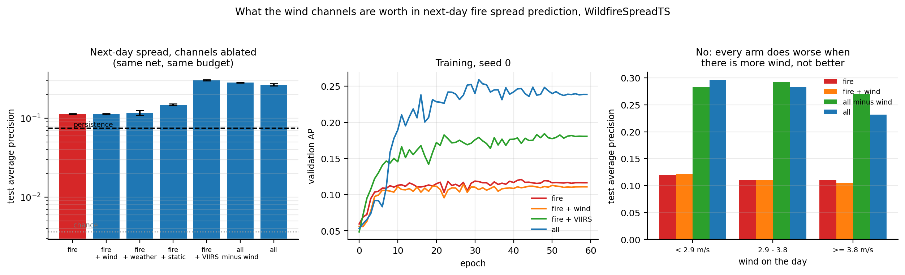

### 15.1 The first run would have been written up wrongly

The first pass had five arms and looked like this: every channel group worth nothing on its
own, and the full 23-channel input nearly doubling the score. Written up as it stood, that
reads as *the weather matters once you give the model all of it*.

It is not what happened. The full input also carries the raw VIIRS bands — M11, I2, I1 —
which show the fire's thermal signature directly rather than through a binary detection
flag. Two arms separate the explanations, and they are decisive:

- **`fire + VIIRS`, four channels, scores 0.3046** — higher than all twenty-three.
- **Removing the wind from the full input makes it better**, 0.2844 against 0.2668. The
  wind channels cost **6 %** when added to everything else.

So the near-tripling is bought by seeing the fire better, not by knowing the weather. Had
those two arms not been run, this section would have claimed the opposite of the truth.

### 15.2 Three times the data changed two of the conclusions

The first version of this experiment ran on 199 of the 607 fires — 714 training pairs —
because Zenodo was throttling the download to 0.4 MB/s. Section 15.4 flagged the strongest
reading as unsupported at that size. The full archive arrived later; the experiment was
rerun unchanged on 1995 training pairs, and the flag was justified:

| arm, vs fire mask only | 714 pairs | **1995 pairs** |
|---|---|---|
| fire + wind | 0.86x | **0.99x** |
| fire + weather | 1.03x | 1.04x |
| fire + terrain and fuel | 1.04x | **1.31x** |
| fire + raw VIIRS bands | 2.21x | **2.67x** |
| all minus wind | 2.06x | 2.50x |
| cost of adding wind to the full input | −13 % | **−6 %** |

- **"The wind channels actively hurt" was an overfitting artefact**, exactly as flagged.
  Two extra noise-like inputs against 486 321 parameters and 714 samples cost 14 %; with
  2.8x the data they cost 1 %. The honest version is that they buy **nothing**, not that
  they harm.
- **The terrain and fuel channels were data-starved, and are not worthless.** They go from
  1.04x to **1.31x** — the one arm whose verdict reverses. That lines up with section
  14.3, where fuel and terrain explained nine times more of a real fire's daily advance
  than the wind did; with enough data the learned model recovers the same ordering.
- **The imagery result strengthens**, 2.21x to 2.67x, and the conclusion it supports is
  unchanged.

### 15.3 And the wind is worth less where there is more of it

If the wind channels carried usable information, their value should rise with the wind.
Test AP by the wind on the day:

| wind | pairs | fire | fire + wind | all minus wind | all |
|---|---|---|---|---|---|
| <  2.9 m/s | 472 | 0.1202 | 0.1212 | 0.2830 | 0.2960 |
| 2.9 - 3.8 | 474 | 0.1100 | 0.1103 | 0.2931 | 0.2836 |
| ≥  3.8 m/s | 484 | 0.1101 | 0.1055 | 0.2700 | 0.2321 |

The wind channels buy nothing at any wind speed — 0.1212 against 0.1202 in the lowest
tercile, 0.1055 against 0.1101 in the highest — and the margin the imagery buys over the
fire mask alone shrinks from 2.4x to 2.5x to 2.1x as the wind rises. Nothing here improves
when the wind picks up, which is the opposite of what a channel carrying usable wind
information would do.

### 15.4 The published framing, and why the target was changed

`scripts/wsts_trivial.py`

Choosing a target other than the benchmark's published one needs a number behind it. The
whole ablation was rerun on WildfireSpreadTS's own target — tomorrow's *whole* active fire
rather than only what is newly burning — with nothing else changed:

| arm | new-fire target | vs fire | published target | vs fire |
|---|---|---|---|---|
| **copy today's fire unchanged** | 0.0036 | — | **0.9474** | — |
| ring around today's fire | 0.0755 | 0.66x | 0.0646 | — |
| fire mask only | 0.1139 | 1.00x | 0.9861 | 1.000x |
| fire + wind | 0.1131 | 0.99x | 0.9852 | 0.999x |
| fire + weather | 0.1180 | 1.04x | 0.9865 | 1.000x |
| fire + terrain and fuel | 0.1488 | **1.31x** | 0.9866 | **1.001x** |
| fire + raw VIIRS bands | 0.3046 | **2.67x** | 0.9922 | **1.006x** |
| all minus wind | 0.2844 | 2.50x | 0.9919 | 1.006x |
| all 23 channels | 0.2668 | 2.34x | 0.9918 | 1.006x |

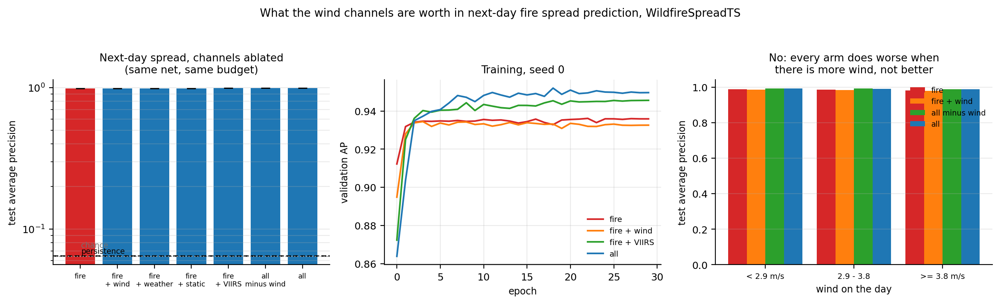

**On the published target, a rule that copies today's fire unchanged and looks at no
channel at all scores 0.9474.** Everything a model contributes — every channel, every one
of 486 321 parameters — is worth 0.045 of AP on top of that. All eight arms then land
between 0.985 and 0.992, a spread of 0.7 %, and the channel set that is worth **2.67x** on
the spread problem is worth **1.006x** here.

The imagery advantage is not absent on the published target, it is compressed: in error
terms `fire` misses 1.39 % and `fire + VIIRS` misses 0.78 %, a **44 % reduction**, which
shows up as 0.006 of AP. A metric where the trivial rule scores 0.95 cannot separate
channels, and that is the reason for measuring them on the spread problem instead.

### 15.5 What this does and does not establish

**It is still not a reproduction of the published baselines**, even on the published
target: this is a monotemporal model on 128x128 crops with one year-split, against a
multi-temporal model on full tiles with cross-validation. The numbers above are a channel
ablation run twice, not a benchmark entry, and nothing should be read across to the
WildfireSpreadTS paper's figures.

**The claim is that the wind channels buy nothing, not that more data would never help.**
1995 training pairs against 486 321 parameters is still a small-data regime, and section
15.2 shows exactly how a conclusion can move with data size: one arm's verdict reversed
between the two runs. A dataset an order of magnitude larger could move the wind arm too.
What is measured here is that going from 714 to 1995 pairs moved the terrain arm by 26 %
and the wind arm by 1 %, in a direction that takes it to neutral rather than useful.

**The overfitting is smaller than before but has not gone.** Validation AP still peaks
before the last epoch for most arms; the reported model is the best-validation checkpoint,
selected on 273 pairs.

**Only one architecture, one crop size and one split.** A multi-temporal model, a full-tile
model, or a different year-split could all behave differently; none was run.

---

## 16. Where did it start? The degeneracy's cost for backtracking

`scripts/retrodiction.py`

Running the fire backwards is the one task in the project plan that comes with free ground
truth: WildfireSpreadTS records every fire from its first VIIRS detection, so the ignition
location and date arrive with the data. **2135 backtracks from 121 real fires** here.

The geometry is exact. If a fire ignited at `p` and has burned for `dt` days at rate `r`,
everything it burned lies within `r*dt` of `p`, so the rate a candidate implies is

```
r(p) = max over burned pixels q of dist(p, q) / dt
```

and the ignition points consistent with a rate known to lie in `[r_lo, r_hi]` are the
level set `F = { p in burn : r_lo <= r(p) <= r_hi }`. Computing it costs a convex hull —
the farthest point of a set from `p` is always a hull vertex — and a few dozen distances
per candidate.

**Note what `F` depends on: not the fuel, not the wind, not the shape law, only on how
well the spread rate is known.** And the spread rate is exactly what section 1 says a burn
scar hands over as a product of fuel and wind that cannot be separated. That converts an
identifiability statement into a number an investigator can act on.

Section 14.3 already measured how well the rate can be known without the fire's own
history: regressing log spread rate on wind, energy release component, NDVI and slope over
940 real fire-days leaves a residual scatter of 0.670 in log — **a factor of 1.96** —
against a population scatter of 0.700, a factor of 2.01. Four regimes follow, all applied
to the same real fires:

| rate known to | median feasible area | as % of the burn scar |
|---|---|---|
| oracle, ±10 % | 14.3 km² | **34 %** |
| covariates, ×1.96 (measured) | 47.1 km² | **100 %** |
| prior only, ×2.01 (measured) | 47.1 km² | **100 %** |
| the fire's own history, ×3.21 | 38.1 km² | 94 % |

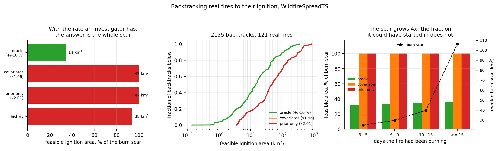

**With the rate knowledge an investigator actually has, backtracking returns the entire
burn scar.** The answer is "it started somewhere in the burned area", which is what was
known before the calculation started. The covariates are worth nothing measurable against
knowing nothing at all about the fire — 47.1 km² against 47.1 km² — which is section 14.3's
R² = 0.084 expressed in square kilometres.

An oracle rate, accurate to ±10 %, narrows it to **a third of the scar**. That is a real
improvement and still not a location. And ±10 % on the rate is precisely what section 1
proves a burn scar cannot supply, because the rate it supplies is `R0 x (1 + phi_w)`.

**Coverage is 100 % by construction** for the three centred regimes — each interval is
built around the rate the true ignition implies, so the truth is inside by definition, and
that is deliberately generous to the weaker regimes since a real covariate prediction is
biased as well as wide. The informative column is the area. Only the history regime, whose
interval comes from the fire's own growth rather than from the answer, has a coverage
number that means anything, and it is **85 %**.

### 16.1 Watching longer does not localise it

The plan's proposition P5 predicted that backward solution yields a feasible *region*
rather than a point, and that the region shrinks as observations accumulate. The first half
is right. The second is backwards:

| days burning | backtracks | median burn | oracle | covariates |
|---|---|---|---|---|
| 3 – 5 | 333 | 25 km² | 7.2 km² (32 %) | 25.0 km² (100 %) |
| 6 – 9 | 447 | 30 km² | 8.9 km² (33 %) | 29.7 km² (100 %) |
| 10 – 15 | 508 | 40 km² | 12.2 km² (35 %) | 39.8 km² (100 %) |
| ≥ 16 | 847 | 106 km² | 40.4 km² (36 %) | 106.3 km² (100 %) |

The absolute feasible area grows 5.6x from the shortest window to the longest — but the
burn scar itself grows 4.2x, so that alone would explain it. The fraction is what controls
for it, and the fraction does not improve: 32 % → 36 % under an oracle rate, flat at 100 %
under the rate an investigator has.

**The operational reading is the opposite of the intuition: backtrack from the earliest
perimeter you have, not the latest.** The smallest feasible set in this sample comes from
the 3–5 day window, at 7.2 km² under an oracle rate and 25.0 km² with a real one. Every
extra day of watching adds burned area that the origin could have been anywhere inside.

---

## 17. An inversion that refuses to report what it cannot determine

`pyrofield/eval/guarded.py`, `scripts/guarded_inversion.py`

Everything above is diagnosis. This is the one thing the diagnosis implies you should
build, and the study's own results dictate both what it has to be and what it cannot be.

**It cannot be a residual check.** Section 12.4 measured that when the *data* does not
contain the answer, the misfit at a parameter set wrong by 85 % is 1.000 times the misfit
at the truth, to three decimals. There is nothing for a goodness-of-fit test to see.

**It cannot be a Fisher matrix.** Section 11 measured that a Fisher analysis at the
solution misses this degeneracy entirely — finite differences report a bound 33x too small,
forward-mode AD one 52x too large — because the null space is a *curve* and a Fisher matrix
only sees its tangent. Section 1 put a number on the gap: a 30 % wind error costs
dchi2 = 0.20 along the exact curve and 791 along the tangent.

What is left is the thing that works. **Force one parameter off by 30 %, re-minimise over
all the others, and read the misfit.** That is one point of a profile likelihood; it is
derivative-free, and it follows the curve because the re-minimisation does. If the misfit
barely moves, the observations do not determine that parameter, whatever the fit reported.
`guard` returns a verdict per parameter — determined with an interval, or not determined —
rather than a number.

The probe is a short fit, not a full one, because the nuisance parameters start from the
converged solution and only have to relax. Measured against the full coarse-to-fine ladder
on four cases:

| probe schedule | mask+plume dchi2 | mask-only dchi2 | cost per point |
|---|---|---|---|
| `((2,3),(0,5))` full ladder | 5502.1 / 1387.8 | 0.0 / 0.4 | 68–83 s |
| **`((0,4))`** used here | **5506.6 / 1387.9** | **0.1 / 0.7** | **36–38 s** |
| `((0,2))` too short | 18215.6 / 1438.2 | 1.3 / **34.9** | 19 s |

Four iterations agree with the full ladder to 0.1 % at half the cost. Two do not, and the
way they fail matters: 34.9 against a true 0.4 would turn an undetermined parameter into a
confident wrong answer, which is the exact failure the guard exists to prevent.

### 17.1 Scoring it where the truth is known

Proposing a guard is not evidence. It is run on section 12's inversions — the same fires,
the same observations, the same converged solutions — so every verdict can be checked.
**62 inversions**, wind speed guarded, with the guard never told which arm it is looking at.

| arm | wind speed called determined | median error in wind speed |
|---|---|---|
| state, mask + plume, in distribution | **88 %** | 0.7 % |
| state, mask + plume, out of distribution | **72 %** | 0.8 % |
| state, mask only | **17 %** | 26.8 % |

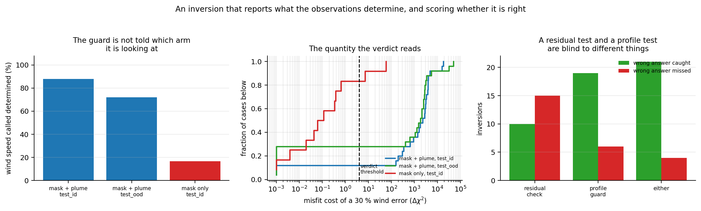

The quantity behind the verdict separates by three to four orders of magnitude: the
mask-only misfit costs for a 30 % wind error run from 1e-3 to about 50, the mask+plume
costs from 1e3 to 1e5. The threshold sits in the gap with room on both sides.

### 17.2 What it catches that a residual check does not

Both tests are run on the same 62 inversions and scored against whether the answer was in
fact wrong by more than 5 % on wind speed. 25 of them were.

| raised by | wrong, caught | wrong, missed | right, flagged |
|---|---|---|---|
| residual check | 10 | 15 | 2 |
| **profile guard** | **19** | **6** | **1** |
| either | 21 | 4 | 2 |

**The residual check catches 40 % of the wrong answers; the profile guard catches 76 %,
with fewer false alarms; together they catch 84 %.** They are blind to different things,
which is section 12.4's result turned into a procedure: an optimiser failure raises the
misfit and a missing-information failure does not, so a system that wants to catch both has
to run both.

### 17.3 Where it is weak, measured rather than asserted

**The verdict is not perfect in either direction.** It calls wind speed determined in 17 %
of mask-only cases, where section 1 proves it is not — 2 of 12, and both of those two have
the truth outside the interval they report. It also calls it *un*determined in 12 % of
in-distribution mask+plume cases and 28 % out of distribution, where the information is
present; those are mostly solutions that converged badly, at which a local probe is flat
for a reason that has nothing to do with the sensors.

**The intervals are consistent with being honest, and 36 cases cannot say better.** A
1-sigma interval should contain the truth about 68 % of the time. Pooled over the cases
that both passed the guard and converged: **22 of 36 = 61 %, with a 95 % interval of
43–77 %**. The nominal 68 % is inside that. The point estimate is low, and scaling sigma by
1.06 would land it exactly on 68 %, but this sample cannot resolve a 6 % error in an
interval width.

**Only wind speed was guarded here.** Each parameter costs two to four short fits — about
2.5 minutes at this scenario size — so guarding all six on all 62 cases was not run. The
machinery does not care which parameter it is given; the evidence presented is for one.

### 17.4 The sensor sufficiency diagram, rebuilt with the instrument that works

`scripts/sufficiency_profile.py`

The project plan's second contribution was a sensor sufficiency diagram: modality subsets
down one axis, state components across the other, each cell marked determined or not. This
repository already had one — `figures/fig_sensor_sufficiency.png` — and section 11 is the
reason it should not be trusted: it is built from Cramér–Rao bounds, and on the degenerate
direction two implementations of the same bound disagree by a factor of 1500. The same
probe that guards an inversion rebuilds the diagram without derivatives, and needs no
inversion at all: standing at the true parameters, how much does the misfit rise if this
parameter is forced off by 30 % and every other one is allowed to re-absorb it?

**Flat ground, 3 m/s** — entries are the 1-sigma precision where the parameter is
determined:

| sensors | R0 | U | theta_w | k_LB | w_buoy | Q |
|---|---|---|---|---|---|---|
| masks | — | — | **0.046°** | — | — | — |
| masks + air quality | — | — | **0.042°** | — | — | — |
| masks + plume | 0.33 % | 0.40 % | 0.044° | 0.50 % | 0.40 % | 0.46 % |
| all three | 0.33 % | 0.40 % | 0.038° | 0.50 % | 0.40 % | 0.45 % |

**20-degree slope, 3 m/s:**

| sensors | R0 | U | theta_w | k_LB | w_buoy | Q |
|---|---|---|---|---|---|---|
| masks | — | — | — | — | — | — |
| masks + air quality | **0.64 %** | **0.85 %** | **0.233°** | **0.83 %** | — | **1.26 %** |
| masks + plume | 0.28 % | 0.36 % | 0.103° | 0.46 % | 0.41 % | 0.50 % |
| all three | 0.26 % | 0.33 % | 0.094° | 0.42 % | 0.37 % | 0.41 % |

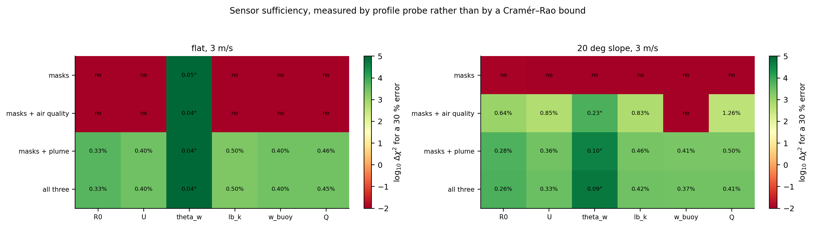

Three readings, and the second is the one worth acting on.

- **Masks determine exactly one thing on flat ground and nothing at all on a slope.** A
  30 % error in any of the six costs a misfit of 0.00 to 0.01 in the slope scene. That is
  section 1 and section 5 in a single table, measured rather than argued.
- **The same cheap sensor is worthless on flat ground and decisive on a slope.** Adding a
  point air-quality reading to masks changes nothing at all on flat ground — which is
  section 9's finding that masks and masks + air quality are indistinguishable — and on a
  slope recovers five of the six parameters. A sufficiency diagram exists to answer "which
  sensor should I buy", and here the answer depends on the terrain, in opposite directions.
- **The plume determines everything in both scenes**, and the air-quality sensor adds
  almost nothing on top of it (0.40 % → 0.40 % on wind speed, flat).

A mechanism for the second reading, offered as a reading and not established here: masks
alone never supply *no* information, they supply constraints that leave a null space, and
whether another sensor helps depends on whether its constraint lies inside that space. On
flat ground the air-quality reading constrains `Q/U`, and with `Q` free that direction is
already spanned. On a slope the mask's constraints are different and weaker, and the same
reading falls outside what they span. Testing that properly means decomposing both
constraint sets, which is not done here.

**Scope.** One scenario per terrain, one noise realisation, one sensor placement, and
probes at a single wind speed. The diagram's *structure* is what the study leans on; its
individual precisions are one draw each.

---

## 18. Inverting a real fire

`scripts/real_fire_inversion.py`

The limits section has carried one sentence since the beginning: *no real fire in this
study was inverted for its parameters*. Every inversion above is an identical-twin
experiment. WildfireSpreadTS removes the excuse — a real fire's day-by-day progression,
with the GRIDMET wind that drove it recorded independently — so this fits the project's own
forward model to **23 real fires** at the satellite's 375 m resolution, with fuel, wind
speed, wind bearing and the shape coefficient free, and checks the answer against the wind.

Two things had to be got right before any of it meant anything, and the first version got
both wrong. The model's time step was fixed at the total duration over 110 steps and the
fuel rate started at 0.05 m/s — about **forty times** what these fires actually do. The
level set then ran at CFL 5 to 19, went NaN, and every fit froze exactly at its starting
values, producing an apparent **5 % wind-speed accuracy that was nothing but the starting
guess sitting near the typical GRIDMET wind**. Section 20's own lesson is to hold the CFL
number fixed rather than the time step; the rate to hold it against now comes from the
observed burn's own growth. Separately, GlobFire records some physical fires twice under
neighbouring ids, and two such records reduce to bit-identical fits — one duplicate pair
was found and dropped.

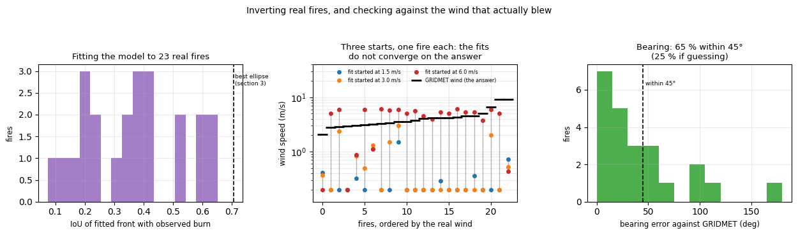

### 18.1 The fits do not converge on the wind; they stay where they started

Each fire is fitted three times, from **1.5, 3.0 and 6.0 m/s** — a 4x span of plausible
winds. If the burn determined the wind, the three would converge on one answer and only one
would fit well.

| | median | p90 |
|---|---|---|
| ratio of largest to smallest **fitted wind**, per fire | **25.4x** | 29.7x |
| ratio of largest to smallest **final misfit**, per fire | 1.92x | 2.79x |

**The answers scatter by a factor of 25 while the fit quality moves by a factor of 2.** On
91 % of fires the three fits stay more than 1.5x apart. The middle panel above shows it
directly: the fitted winds stay sorted by where they started, straddling the real wind
rather than converging on it.

### 18.2 The speed is wrong, the bearing is not

| | value | chance |
|---|---|---|
| wind speed, relative error against GRIDMET | **94 %** (p25 88, p75 95) | — |
| wind bearing, absolute error | **29°** (p25 15, p75 56) | 90° |
| bearings landing within 45° | **65 %** | 25 % |
| guard calls the **speed** determined | **0 % of fires** | — |
| guard calls the **bearing** determined | 26 % of fires | — |

This is section 1's split, on real fires: **the mask gives the bearing and not the speed.**
The bearing is recovered well enough to be useful and not well enough for the guard's
30-degree probe to certify it, which is a coherent picture rather than a contradictory one.

### 18.3 It is not the model's fault, and that was testable

On real fires "the wind is not identifiable" and "the model does not fit" are confounded,
and the model does fit poorly: median IoU of the fitted front with the observed burn is
**0.376**, against the 0.705 that section 3 measured for the best area-matched ellipse. The
honest way to separate them is to ask whether the fires the model *does* fit behave any
differently:

| fit quality | fires | median wind spread across starts | median wind error | bearing error |
|---|---|---|---|---|
| IoU < 0.38 | 11 | 26.6x | 93 % | 29° |
| **IoU ≥ 0.38** | 12 | **23.8x** | **94 %** | 35° |

**They do not.** The fires the model describes well fail to determine the wind exactly as
badly as the ones it describes poorly. Misspecification is therefore not the explanation
for the failure, which leaves the one section 1 proves.

### 18.4 Limits

23 fires, chosen by filters (at least four observation days, a burn that actually grows, no
swath artefact) that favour well-observed fires and are not a random sample of the 607.
GRIDMET is a 4 km daily summary and not the wind at the flame, so the 94 % error is an
upper bound on the inversion's own error — but the **start-dependence** in 18.1 and the
**stratification** in 18.3 do not depend on GRIDMET being right at all, and those are what
the section rests on. The fit uses masks only: no plume is available from VIIRS, so this
measures the mask-only arm and says nothing about what a camera would add.

---

## 19. The physics kernel is correct

`scripts/validate_physics.py`, against closed-form solutions.

| check | result | target |
|---|---|---|
| zero-wind front radius vs `r0 + R0*t` | 1.79 % error | < 5 % |
| grid anisotropy of a circular front | **0.00 %** | < 5 % |
| head distance vs elliptical template | 0.92 % error | < 5 % |
| back distance vs elliptical template | 2.93 % error | < 10 % |
| burn region vs exact Huygens-Minkowski set | **IoU 0.9859** | > 0.95 |
| `norm(grad phi)` in the narrow band, with reinitialisation | 0.998 +/- 0.005 | ~ 1 |

Two bugs were found by these checks:

**The spread rate must be a support function, not a radius.** Using the elliptical
wavelet's radial distance as the level-set normal speed starved the flanks and left the
head at 41 % of its analytic distance. Huygens' principle requires the support function
`c*cos(d) + sqrt(a^2 cos^2(d) + b^2 sin^2(d))`. After the fix the head error is 0.92 %.

**First-order upwinding made the diagonals slow.** A circular front showed 5.6 %
anisotropy — indistinguishable from a real wind effect, and wind is the quantity this study
is trying to identify. Second-order ENO with a minmod limiter took it to 0.00 %.

### Regression invariants

`scripts/test_invariants.py` — 5/5 pass.

- **Truncation consistency**: a run to step T reproduces a longer run *exactly* (0.000e+00
  on all three modalities), so curves against observation window compare amounts of data,
  not different physics.
- **Fisher monotonicity**: violations occur only where CRB > 1, i.e. where the matrix is
  numerically singular and the answer is "no information" anyway.
- **Trilinear interpolation** matches `grid_sample` to 1.9e-6 over 4000 points including
  samples outside the volume. It replaced `grid_sample`, which has no forward-mode autodiff
  rule in 3-D.
- **AD reproducibility**: identical to the last digit across runs.

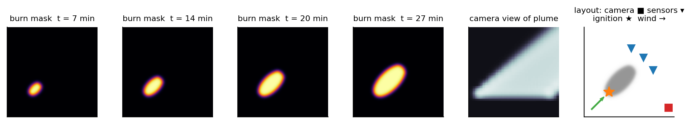

---

## 20. Hypotheses the data corrected

Twenty-two, numbered from zero because the first one is about the physics the rest is built on.
They are listed because the corrections are the part of this study most worth trusting:
each was forced by a measurement that contradicted what I had written down beforehand.

0. **"The elliptical template used by FARSITE has a fuel-dependent shape coefficient."**
   Asserted, never checked, and load-bearing for the whole study. Checking it against the
   published model (section 2) found that the head-rate half was exactly right — Rothermel
   (1972) is `R0 (1 + phi_w + phi_s)` — while the shape half was not: FARSITE uses
   Anderson (1983), which has no free fuel parameter. Taken literally that breaks the
   degeneracy below 3.8 m/s. What survives is narrower and better grounded: the shape
   channel saturates at 3.80 m/s and is one-sided above it, and it separates fuel from
   wind below that only if Anderson's single curve is exact for the fuel present. The
   headline was rewritten around the measurement rather than the other way round.

1. **"Masks cannot determine the wind."** On flat ground they determine its *direction*
   very well (sigma ~ 0.02 deg). The claim had to be narrowed to wind *speed* — and then
   widened again for terrain (section 5), where direction goes too.
2. **"Mask identifiability is a fixed property."** It is a steep function of how far the
   fire has run — 312x worse at a 9-minute window than at 27.5 minutes under the linearised
   bound. The degeneracy is worst exactly where the information is worth most.
3. **"A cheap air-quality sensor also solves the wind problem."** That was an artefact of
   conditioning on `Q` being known: given `Q`, one concentration reading hands you `U`
   through the `Q/U` term. With all six parameters free, masks and masks+air-quality are
   indistinguishable for wind speed (19.8 vs 19.7 min). The plume is what breaks it.
4. **"...and its distinct job is supplying `Q`."** Only when the camera saturates. The
   original measurement was taken on a renderer at optical depth ~3200; once the extinction
   was calibrated to tau ~ 3 the camera determines `Q` on its own and the sensor's marginal
   value drops from 2.5x to 1.0x.
5. **"The Fisher matrix answers the identifiability question."** Section 11.
6. **"The worst slope aspect is across the wind."** It is at 120 degrees, where the slope
   partly opposes the wind and swings the resultant further than a perpendicular slope
   does. And at 180 degrees with a slope factor above the wind factor the burn scar does
   not merely mislead — it reverses, and a mask reports a wind blowing the opposite way
   (section 5).
7. **"In terrain the plume simply gives the right wind."** It does, but only if the slope is
   allowed to float. Fitting a flat model with the plume attached still gives a 21-degree
   error — what the plume actually does is make the mis-specification *visible* (chi2/N
   2.22 against 1.008 for masks). Getting the answer requires the right procedure as well
   as the right sensor.
8. **"Real perimeters will behave roughly like the simulated ones, only noisier."** They do
   not. The best area-matched ellipse reaches a median IoU of only **0.705** and **not one**
   of 895 fires exceeds 0.90; half are not even a single connected blob. Worse for the
   study's own framing, real fires cluster at L/B ~ 1.8, where the shape-to-wind elasticity
   is 0.67 — i.e. *below* the saturation regime section 2 spends its argument on, in a
   regime that is weak for a different reason. The saturation cap turned out to be the less
   important half of the story on real data (section 3).
9. **"The state-level inversion simply extrapolates, where the network does not."** Its
   *median* did — 0.7 % in distribution, 0.8 % out of it, on the 25 fires it was measured
   on. But the distribution is bimodal,
   and that median was hiding a failure rate of 16 % in distribution and **36 %** out of it,
   which would have been written up as a clean win. Checking what the failures *were* turned
   the caveat into the study's sharpest single result: out of distribution 8 of 9 are
   optimiser failures that a goodness-of-fit check catches with no ground truth, while
   **all twelve** mask-only failures fit the data exactly as well as the truth does and no
   check can catch them (section 12.4). Look at the tail before quoting the median.
10. **"PyTorchFire's shape has no cap, so its L/B grows without bound."** Derived from the
    one-step probability ellipse, which says L/B reaches 49.6 at 45 m/s. Measuring it
    instead: L/B peaks at **1.54 around 8 m/s and then falls back to 1.13** — the one-step
    ellipse is wrong by 44x, because a per-step ignition *probability* is not a spread
    *speed*, and lateral progress is subsidised by cheap downwind-diagonal paths. Two
    further claims I wrote before checking also failed: that the head elasticity decays
    (it rises), and that the fire extinguishes at high wind (its area plateaus at 17 %).
    A rotation test then showed 19 % of the measured shape is the lattice rather than the
    fire (section 13.4). **A mean-field summary of a stochastic model is not that model**,
    and the correction cost nothing but running it.
11. **"Restarting the optimiser will do nothing for the mask-only inversion, because every
    candidate has the same misfit."** Written into the script before running it, and
    wrong. Three starts move the mask-only median from 26.8 % to 19.1 % and halve the p90.
    The reason is geometric and was there to be worked out beforehand: the starting
    perturbation is isotropic in six parameters, so only **1/6** of it lies along the null
    direction. Restarting cleans up part of the other five sixths. What survives the
    correction is the sharper statement — the mask-only arm has a **computable floor of
    8.6 %** that no optimiser can cross, it does not even reach that floor, and the plume
    arm gets to 0.4 % (section 12.5).
12. **"The detections in a fire's satellite tile belong to that fire."** They do not. A
    WildfireSpreadTS tile is 90 km across and carries every VIIRS detection in it, plus
    swath artefacts — one scene has a solid rectangle of 11 939 detections spanning the
    full tile width on a single day. Ungated, this produced an overnight "advance" of
    19 km and a headline correlation of **r = -0.266**: windier days, slower fires. Gating
    on proximity and rejecting swath days turned it into +0.096. **The sign was wrong and
    only plotting the scenes showed why** (section 14.1).
13. **"Conditioning on the fuel will sharpen the wind term."** The confound is `R0 x wind`,
    so holding the fuel still should recover the wind — that was the mechanism test, and
    it failed. Adding the energy release component, NDVI and slope multiplies R^2 by 9,
    confirming the fuel dominates, but the standard error on the wind coefficient moves
    from 0.0615 to 0.0623: not at all. The fuel proxies an operational system actually has
    are not good enough to break the confound (section 14.3).
14. **"The bearing channel sharpens with measurement quality and the speed channel does
    not."** Written as a conclusion before it was checked. Both sharpen, and together:
    bearing R goes 0.146 to 0.328 and advance r goes 0.118 to 0.234 over the same quality
    sweep. That kills the clean version of the real-data story and leaves the honest one —
    the satellite data is *consistent* with the degeneracy and cannot establish it, because
    measurement noise explains the weak speed signal just as well (section 14.4).
15. **"The ignition feasible set shrinks as the fire is watched for longer."** The project
    plan's proposition P5, and half right: the backward solution is a *region* rather than
    a point, as predicted. But the region does not shrink. Its absolute area grows 5.6x
    from a 3-day window to a 16-day one, and as a fraction of the burn scar it goes
    **32 % to 36 %** under an oracle rate and sits flat at **100 %** under the rate an
    investigator can actually obtain. Backtrack from the earliest perimeter, not the
    latest (section 16.1).
16. **"The full 23-channel input nearly doubles the score, so the weather matters once the
    model has all of it."** That is what the first channel-ablation run looked like: every
    group worth nothing alone, everything together worth 1.88x. It is the opposite of the
    truth. Two arms added to separate the explanations found that **four channels — the
    fire mask plus the raw VIIRS bands — score higher than all twenty-three**, and that
    **removing the wind from the full input improves it by 13 %**. The gain is from seeing
    the fire's thermal signature directly instead of through a binary detection flag.
    Written up as first run, this section would have claimed the reverse (section 15.1).
17. **"The guard's intervals under-cover: 55 % against a nominal 68 %."** That was the
    first reading of the calibration table and it was wrong twice over. Part of the gap is
    cases where the inversion converged badly, and an interval drawn around the wrong
    point says nothing about the interval's *width*; excluding those gives 61 %. The rest
    is sample size: 36 cases put a 95 % interval of **43–77 %** around that, which
    contains the nominal 68 %. The honest statement is that the intervals are consistent
    with being honest and that this sample cannot resolve the 6 % sigma scaling that would
    centre them (section 17.3). A point estimate quoted without its interval was about to
    become a finding.
18. **"The wind channels actively hurt a next-day spread model."** Measured at 0.86x the
    fire mask alone on 714 training pairs, flagged at the time as at least as consistent
    with overfitting as with information. The full archive arrived, the experiment was
    rerun unchanged on **1995** pairs, and the flag was right: **0.99x**. The terrain and
    fuel channels moved the other way and further — 1.04x to **1.31x** — so the one arm
    that reversed was the one the first run called worthless (section 15.2). The surviving
    claim is the weaker and better-supported one: the wind channels buy nothing.

19. **"The model recovers a real fire's wind to 5 %."** The first real-fire inversion said
    so, and it was an artefact twice over. The fuel rate started forty times too fast, the
    level set ran at CFL 5-19 and went NaN, so **every fit froze exactly at its starting
    values** — and the starting wind of 3.0 m/s happened to sit near the typical GRIDMET
    wind, which turned a frozen optimiser into an apparent triumph. Fixing the time step
    from the observed growth rate gives the real number: **94 %** (section 18). Section 20
    already contained the lesson — hold the CFL number fixed, not the time step — and I
    broke it anyway.
20. **"On real fires, a failed inversion means the model does not fit."** The plausible
    alternative to non-identifiability, and testable rather than arguable: split the fires
    by how well the model fits them. The half it describes well (IoU >= 0.38) fails to
    determine the wind **exactly as badly** as the half it describes poorly — 23.8x against
    26.6x start-dependence, 94 % against 93 % error. Misspecification is not the
    explanation (section 18.3).

21. **"The state-level inversion's out-of-distribution median is 0.8 %."** Quoted in the
    headline table, used to compute a 21x advantage over the network, and used again to
    claim the gap between the two fusion levels *widens eightfold* when the data moves.
    Rerunning the same arms on **60 independently drawn fires** gives **5.0 %**, with a
    95 % interval of [1.6, 13.2] that excludes 0.8 %; the advantage becomes 3.3x and the
    gap **narrows** rather than widening. The cause is not bad luck but the bimodality
    section 12.4 had already identified and then quoted a median across anyway: the two
    modes sit three orders of magnitude apart and the median lands wherever a handful of
    cases tips a near-50 % failure rate. The mask-only control reproduced exactly, 26.8 %
    against 26.9 %, which is how a control that measures the seed should behave
    (section 12.6). **A statistic I had already shown to be unsuitable was still the
    headline.**

Three came from my own bugs — an uncalibrated extinction coefficient; a period when the
Fisher code defaulted to forward-mode AD; and a road in the forecast ensemble placed at a
distance measured along the slanted post-shift wind but scored as a constant-`y` line,
which produced spurious zero-width windows in half the scenarios. Each was caught by a
check that existed for another reason — inspecting the rendered image, testing bound
monotonicity, and widening the domain to reduce a rejection rate — which is the argument
for running those checks even when nothing seems wrong.

---

## 21. Limits of what was shown

- **The inversion experiments are synthetic identical-twin experiments** by construction.
  Section 10 tests that directly and finds the plume advantage survives a 15 % error in the
  spread model, and section 5 finds it survives a completely omitted terrain term — but
  real data carries forms of model error this setup has none of. Absolute precision for the
  full sensor set (0.095 % on wind speed) is therefore optimistic. The *relative* comparison
  between sensor subsets is the defensible output, and the degeneracy itself is algebraic
  rather than statistical (section 1) and reproduces in a third-party simulator
  (section 13). Sections 3 and 14 are real — 895 NIFC perimeters with ERA5, and 1044
  fire-days of VIIRS progression with GRIDMET — and they validate the load-bearing
  assumption and the operational consequence. **Section 18 inverts 23 real fires** and
  scores the recovered wind against GRIDMET, which is the pipeline test this entry used to
  say had never been run; its own limits are in 18.4, chiefly that the fires are
  filter-selected rather than a random sample of the 607, and that the fit uses masks only,
  so it measures the mask-only arm and says nothing about what a camera would add.
- **The learned baseline in section 15 is still a small-data result, and one of its
  readings has already moved once.** The first run used 199 of the 607 fires — 714 training
  pairs — and reported that the wind channels *hurt*, at 0.86x. The full archive arrived,
  the same experiment on 1995 pairs gave 0.99x, and the terrain arm reversed from 1.04x to
  1.31x (section 15.2). 1995 pairs against 486 321 parameters is still small, so the same
  thing could happen again at another order of magnitude; what is measured is that the
  wind arm moved by 1 % over a 2.8x increase and the terrain arm by 26 %. It is also not a
  reproduction of the published baselines even on the published target — monotemporal, on
  128x128 crops, one year-split — so nothing should be read across to the
  WildfireSpreadTS paper's figures (section 15.5).
- **Section 14 cannot separate a missing signal from a badly measured one.** Both the
  bearing and the advance-rate associations strengthen with detections per day, and by
  similar factors (section 14.4), so measurement noise explains the weak speed signal as
  well as the degeneracy does. What section 14 establishes on its own is operational — at
  the best quality available, the advance explains under 6 % of the variance in wind — not
  identifiability. Identifiability rests on section 1 and section 13. The sampling is also
  not neutral: WildfireSpreadTS fires are almost all in the mountainous western United
  States, which is why section 5's terrain prediction is untested rather than tested there.
- The degeneracy is a property of **factoring the front into a head rate and a shape**, not
  of any one implementation. The head-rate half is Rothermel (1972) verbatim; the shape half
  is where the assumptions live, and section 2 measures all four regimes rather than
  assuming one. Neither fuel heterogeneity (section 6) nor a wrong wind exponent
  (section 10) disturbs it, and section 13 reproduces it exactly in a third-party stochastic
  cellular automaton with no shared code, numerics or spread law. But that cross-check
  confirms the mechanism rather than escaping it: **both models factor the front the same
  way**. A model that broke the factorisation at sub-front scale — spotting, crown
  transitions, fuel structure finer than the front — would leak some information back into
  the masks. How much is not measured here, in either model.
- **The load-bearing assumption is that Anderson's length-to-breadth relation carries
  fuel-to-fuel variation.** Section 2 quantifies what it would take for that not to matter:
  the relation would have to be known to 8-21 % depending on wind speed. That bracket used
  to be *inferred* from Alexander's r = 0.865 and was the weakest link in the study.
  **Section 3 measures it instead: 46 % on 895 real fires**, against an inferred 15-35 %.
  The measurement is an upper bound on the relation's own scatter — ERA5 is 25 km
  reanalysis and final perimeters carry suppression, both of which inflate it — so the
  honest reading is "at most 46 %, and not plausibly below the 8-21 % the argument would
  need". The downstream experiments still use the limiting case (a completely free
  coefficient), which is the most favourable assumption for the argument being made and
  should be read that way.
- **Section 3's real-data test is about final perimeters, not the forecasting problem.**
  A final perimeter integrates a whole active period, including suppression, against a
  single summary wind. The study's own claim concerns the *instantaneous* inference a
  forecaster makes mid-fire, which no public dataset scores directly. The two agree in
  direction — both say the shape channel is weak — but section 3 is evidence about the
  assumption, not a measurement of the forecasting error.
- **Section 16's backtracking assumes isotropic spread and an unbiased rate.** The feasible
  set is built from `max dist(p, q) <= r*dt`, which is a circle, not the ellipse the rest of
  the study spends its time on; an anisotropic version would give a smaller set for a known
  wind direction and is not done here. Every rate interval is also centred on the rate the
  true ignition implies, which is generous to the weaker regimes, since a real covariate
  prediction is biased as well as wide. Both simplifications make the reported feasible
  areas **optimistic**, which is the safe direction for the conclusion being drawn.
- **The fusion-level ablation (section 12) rests on small inversion samples and one
  architecture.** The state-level arms are 25 fires per split for mask + plume and 12 for
  mask only, so a failure rate quoted as 36 % carries a 95 % interval of roughly 18-57 %;
  the CNN arms are 500 fires per split and carry no such caveat. The network is a single
  standard feature-level design at matched budget, with no wind-speed augmentation and no
  physics-informed loss, any of which would narrow the gap. And the inversion's 53 s per
  fire against the network's sub-millisecond forward pass is not a margin any deployment
  would ignore. What the section establishes is a qualitative distinction that in-
  distribution accuracy cannot see, not a recommended system.
- Profile likelihoods were computed for wind speed and wind direction on two sensor subsets
  each, and for the lead-time curve on two. `R0`, `k_LB`, `w_buoy` and `Q` still rest on
  linearised bounds. `R0` and `k_LB` sit on the same null curve as wind speed, so their
  bounds should be assumed as badly overstated as its.
- The terrain fits use one slope magnitude at one aspect; magnitude and aspect are each
  swept separately (section 5), not jointly, and the aspect sweep's identifiability half is
  Fisher-based rather than profile-based. The geometry half is closed-form and needs no
  such caveat.
- The forecast ensemble keeps 69 of 80 draws; the remainder are rejected on geometry. An
  earlier version kept only 38 of 80 on a smaller domain, and including the previously
  rejected fires made every headline number *worse* (median window 5.0 -> 6.0 min, worst
  IoU 0.444 -> 0.175), confirming the rejection had been biased against the fastest fires.
  A residual bias of the same kind cannot be excluded.
